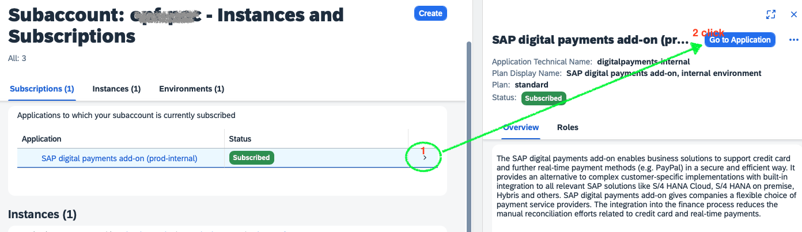
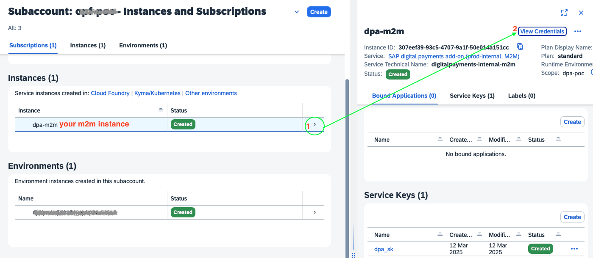
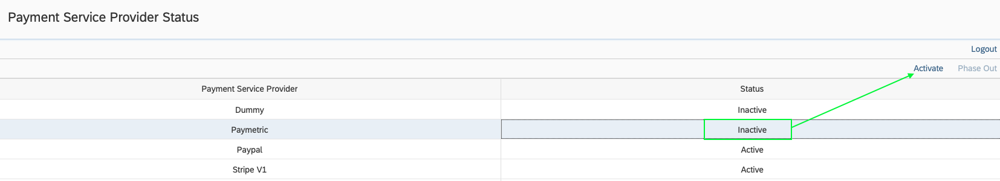
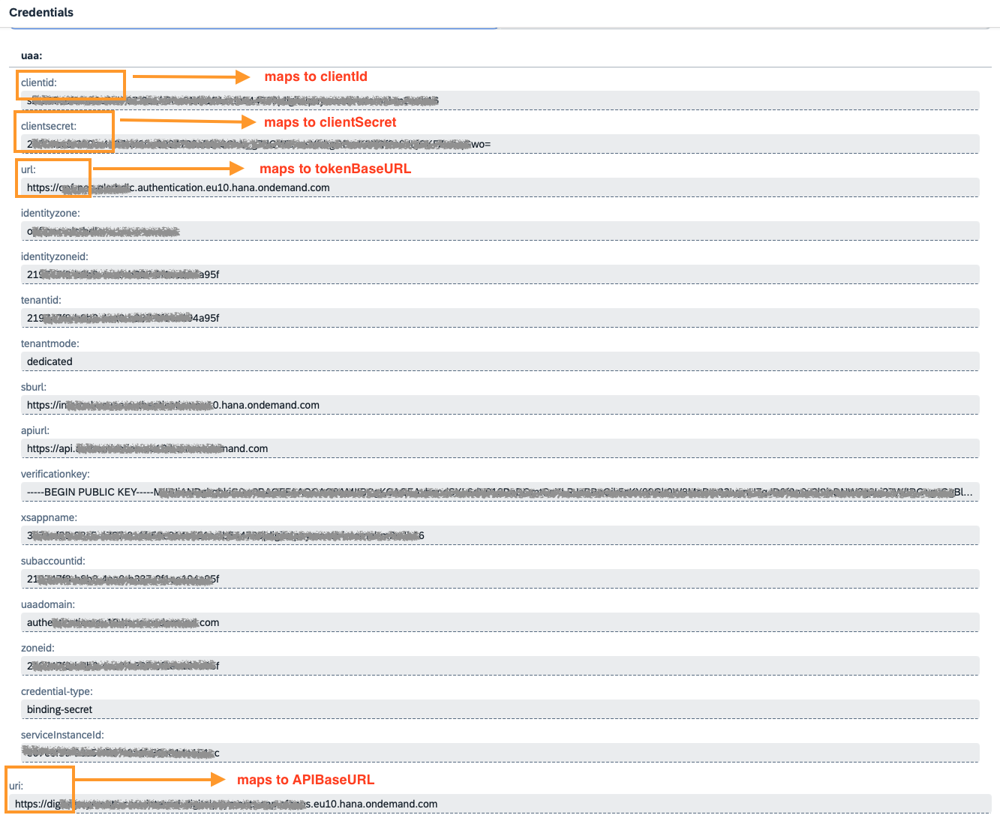
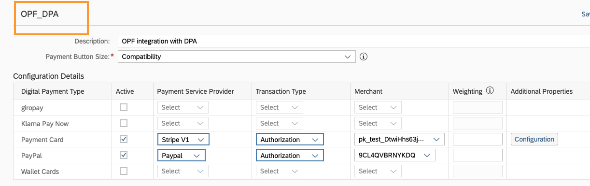

## Introduction ##
This Postman Collection aids in integrating [SAP Digital Payments Add-On](https://help.sap.com/docs/DIGITALPAYMENTS) into the Open Payment Framework (OPF).

The integration supports:

* Authorize card using Hosted Fields

**Note**:
OPF adheres to the [Payment Page](https://help.sap.com/docs/DIGITALPAYMENTS/62bf12232b35472b90d531f867ffacd1/ef14447dc6d2419eaa8207f2521c487b.html) process outlined by the Digital Payment Add-on and the Payment Service Provider (PSP). 
This integration involves externally authorizing cards within OPF and finalizing transactions. All settlements and refunds are initiated outside of OPF.

### In summary ###
In summary, to import the [Postman Collection](mapping_configuration.json), this page will guide you through the following steps:

a) Account Setup.

b) Activating PSPs (As DigitalPaymentsAdministrator).

c) Connecting the SAP Digital Payment Add-on and the PSP (As DigitalPaymentsAdministrator).

d) Setting up the Payment Service Provider Determination (As Key User)

e) Setting up the Payment Page (As Key User)

f) Creating a SAP Digital Payments Add-on Integration in OPF

g) Get the credentials for your SAP Digital Payments Add-on integration

h) Prepare the [Postman Environment](environment_configuration.json) file so the collection can be imported with all your OPF Tenant and SAP Digital Payment Add-on unique values. 

### Account Setup
Please perform the following steps based on the [Administration Guide of SAP Digital Payments Add-on](https://help.sap.com/docs/DIGITALPAYMENTS/a5c364402f8d4c0b99f6a4c7de385a56/1dedbb58ac1747dea8d768d971c1e484.html):

a) Create a subaccount (SaaS tenant) in your global account (GA). 

b) Configure the Identity Provider (IdP) and set up authentication.

c) Subscribe the SaaS tenant to the SAP digital payments add-on.

d) Create role collections and assign them to user groups or users.

e) Enable machine-to-machine (M2M) communication.

After those steps, you can:

a) visit the Welcome page of Digital Payments Add-on application

**Note**:
The link of this Welcome page is: `{BaseURL} + index.html`.

b) Create and get your Service Key

### Activating PSPs (As DigitalPaymentsAdministrator) ###
Go to the following link to activate your preferred PSPs.
{BaseURL}+/pspStatus/index.html

### Connecting the SAP Digital Payment Add-on and the PSP (As DigitalPaymentsAdministrator) ###
Refer to this [Administration Guide](https://help.sap.com/docs/DIGITALPAYMENTS/a5c364402f8d4c0b99f6a4c7de385a56/dcc3fc991bbf425c837b9825b7ae030f.html) to connect the SAP Digital Payment Add-on and the active PSPs,
e.g. Paypal: `{BaseURL}+/paypalOnboarding/index.html`

### Setting up the Payment Service Provider Determination (As Key User) ###
Refer to this [Key User Guide](https://help.sap.com/docs/DIGITALPAYMENTS/d9dc52ba228e4552b13d3ff6b7f55c7f/e7cc0a840bcc455cbcdc108fef122076.html) to finish the configuration of payment service provider determination
The link of your configuration page is: `{BaseURL}+/pspDetermination/index.html`

### Setting up the Payment Page (As Key User) ###
Refer to [Key User Guide](https://help.sap.com/docs/DIGITALPAYMENTS/d9dc52ba228e4552b13d3ff6b7f55c7f/4f1a6cd1b1d34b45b3781968b5351219.html) to finish the configuration of payment page
The link of your configuration page is: `{BaseURL}+/paymentPageConfiguration/index.html`

### Creating a SAP Digital Payments Add-on Integration in OPF ###
Create a Digital Payments Add-on integration in the OPF workbench. For reference, see [Creating Payment Integration
](https://help.sap.com/docs/OPEN_PAYMENT_FRAMEWORK/3580ff1b17144b8780c055bbb7c2bed3/20a64f954df1425391757759011e7e6b.html).

**Note**:
You can name the Merchant ID as your prefer.

### Get the credentials for your SAP Digital Payments Add-on integration
Fetch those values :``clientid`` ``clientsecret`` ``url`` ``uri`` from the Service key which you have created in step [e](#account-setup) of Account Setup

### Preparing the Postman environment_configuration file ###

**1. Token**

Get your access token by [creating an external app](https://help.sap.com/docs/OPEN_PAYMENT_FRAMEWORK/8ccca5bb539a49258e924b467ee4e1c2/d927d21974fe4b368e063f72733bf0fe.html) and [making authorized API calls](https://help.sap.com/docs/OPEN_PAYMENT_FRAMEWORK/8ccca5bb539a49258e924b467ee4e1c2/40c792e66e2942209dc853a43533d78d.html).

Copy the value of the access_token field (it’s a JWT) and set as the ``token`` value in the environment file.

**IMPORTANT**: Ensure the value is prefixed with **Bearer**, e.g. ``Bearer {{token}}``.

**2. Root url**

The ``rootUrl`` is the **BASE URL** of your OPF tenant.

E.g. if your workbench/OPF cockpit url was this …

`https://opf-iss-d0.uis.commerce.stage.context.cloud.sap/opf-workbench`.

The base Url would be:

`https://opf-iss-d0.uis.commerce.stage.context.cloud.sap`.

**3. Integration ID and Configuration ID**

The ``integrationId`` and ``configurationId`` values identify the payment integration and payment configuration, which can be found in the top left of your **Configuration Details** page in the OPF workbench.

* ``integrationId`` maps to ``accountGroupId`` in Postman
* ``configurationId`` maps to ``accountId`` in Postman

**4. ``tokenBaseURL`` ``clientId`` ``clientSecret`` ``APIBaseURL``**

Please fill in those 4 mandatory variables according to the step [Get the credentials for your SAP Digital Payments Add-on integration](#get-the-credentials-for-your-sap-digital-payments-add-on-integration)

**5. paymentPageName**

Go to the Payment Page and get the name on the top for the selected configuration

### Allowlist
Add the following domains to the domain allowlist in OPF workbench. For instructions, see [Adding Tenant-specific Domain to Allowlist
](https://help.sap.com/docs/OPEN_PAYMENT_FRAMEWORK/3580ff1b17144b8780c055bbb7c2bed3/a6836485b4494cfaad4033b4ee7a9c64.html).

``<Region>.hana.ondemand.com`` 

**Note**:
region value can be eu10, us10 etc.

### Summary

The environment file is now ready for importing into Postman together with the Mapping Configuration Collection file. Ensure you select the correct environment before running the collection.

In summary, you should have edited the following variables: 

#### Common
- ``token``
- ``rootUrl``
- ``accountGroupId``
- ``accountId`` 

#### SAP Digital Payment Add-on Specific
- ``tokenBaseURL``
- ``clientId``
- ``clientSecret``
- ``APIBaseURL``
- ``paymentPageName``

  
