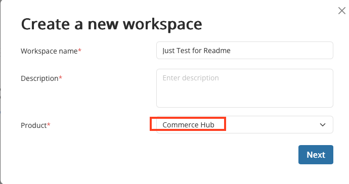
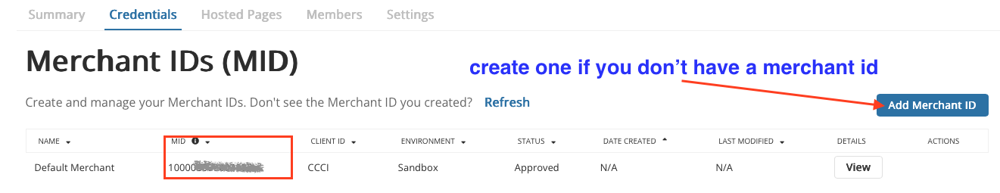
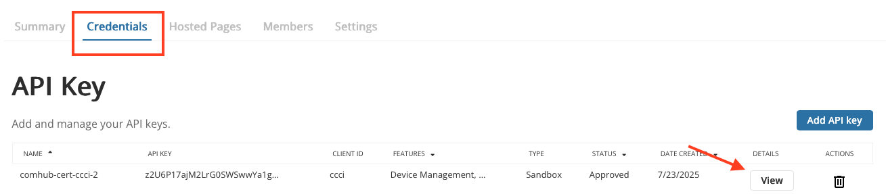
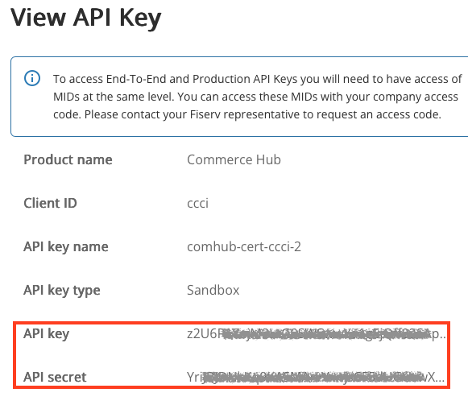
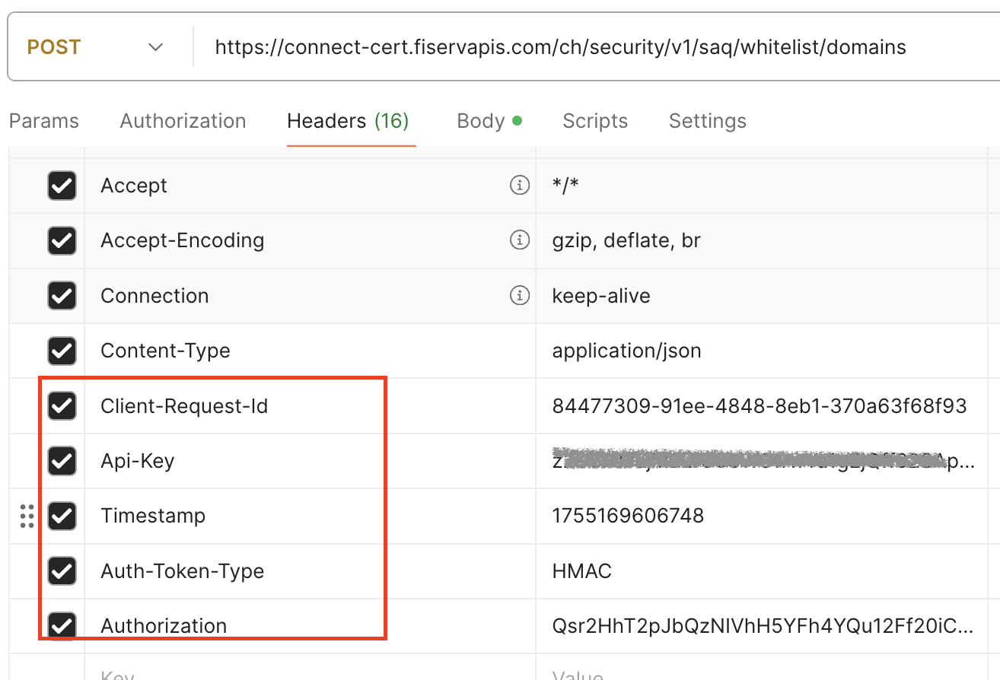
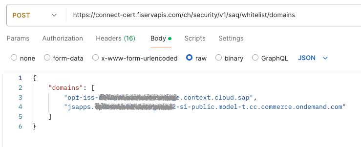

## Introduction

The Postman Collection enables a [fiserv. Commerce Hub](https://developer.fiserv.com/product/CommerceHub/docs/?path=docs/Online-Mobile-Digital/Hosted-Checkout/Hosted-Checkout.md&branch=main) Hosted Checkout Solution to be used to take payments through OPF. 

The integration supports:

* Authorize card using Hosted Fields
* Capture
* Refund
* Reversal
* Reauthorization (only for amount increased)

## Setup Instructions

### Overview
To import the [fiserv. Commerce Hub Hosted Checkout Solution](mapping_configuration.json) this page will take you through the following steps:

a) Create your fiserv. Commerce Hub Account

b) Create a payment integration in OPF workbench.

c) Prepare the [Postman Environment](environment_configuration.json) file so the collection can be imported with all your OPF Tenant and fiserv. Commerce Hub Demo Account unique values. 

d) Whitelist domains for use with Commerce Hub (key step for commerce hub integration) .

### Create your fiserv. Commerce Hub Account

a) You can Create a free Account at <https://developer.fiserv.com>

b) Go to your Workspaces and add a new workspace for Commerce Hub.

### Creating Payment Integration
Create a new integration in the OPF workbench and set the Merchant ID. For reference, see [Creating Payment Integration](https://help.sap.com/docs/OPEN_PAYMENT_FRAMEWORK/3580ff1b17144b8780c055bbb7c2bed3/20a64f954df1425391757759011e7e6b.html).

**Note**

a) You can skip step 4 for the notification Since this PSP doesn't support for server to server notifications .

b) In step 6, you can find the unique Merchant ID name in your Commerce Hub Workspace.

### Preparing the Postman environment_configuration file

**1. Token**

Get your access token by [creating an external app](https://help.sap.com/docs/OPEN_PAYMENT_FRAMEWORK/8ccca5bb539a49258e924b467ee4e1c2/d927d21974fe4b368e063f72733bf0fe.html) and [making authorized API calls](https://help.sap.com/docs/OPEN_PAYMENT_FRAMEWORK/8ccca5bb539a49258e924b467ee4e1c2/40c792e66e2942209dc853a43533d78d.html).

Copy the value of the access_token field (it’s a JWT) and set as the ``token`` value in the environment file.

IMPORTANT: Ensure the value is prefixed with **Bearer**. e.g. ``Bearer {{token}}``.

**2. Root url**

The ``rootUrl`` is the **BASE URL** of your OPF tenant.

E.g. if your workbench/OPF cockpit url was this …

<https://opf-iss-d0.uis.commerce.stage.context.cloud.sap/opf-workbench>.

The base Url would be

https://opf-iss-d0.uis.commerce.stage.context.cloud.sap.

**3. Integration ID and Configuration ID**

The ``integrationId`` and ``configurationId`` values identify the payment integration and payment configuration, which can be found in the top left of your **Configuration Details** page in the OPF workbench.

* ``integrationId`` maps to ``accountGroupId`` in postman
* ``configurationId`` maps to ``accountId`` in postman

**4. API Credentials**

The fiserv. Commerce Hub API operates through an API KEY and SECRET KEY, 
both keys can be retrieved from the workspace you have created > Credentials > API key:

Click the "View" button and find the keys here:

* ``API key`` maps to ``apiKey`` in postman
* ``API secret`` maps to ``apiSecret`` in postman

### Whitelist domains for use with Commerce Hub

The fiserv. Commerce Hub's Hosted Checkout requires the integrated domains to be whitelisted for the Content-Security-Policy.

You can use the postman tool or other API tools to make this first API call. [More information](https://developer.fiserv.com/product/CommerceHub/docs/?path=docs/Resources/API-Documents/Security/Whitelist.md&branch=main#payload-example)

**Note**

Following are the required headers for this API call. Here are the details for the [HMAC Message Signature](https://developer.fiserv.com/product/CommerceHub/docs/?path=docs/Resources/API-Documents/Authentication-Header.md&branch=main):

Following is an example of the body for this API call (input the base URLs of your OPF workbench and frontend)

### Allowlist
Add the following domains to the domain allowlist in OPF workbench. For instructions, see [Adding Tenant-specific Domain to Allowlist
](https://help.sap.com/docs/OPEN_PAYMENT_FRAMEWORK/3580ff1b17144b8780c055bbb7c2bed3/a6836485b4494cfaad4033b4ee7a9c64.html).

Sandbox: ``connect-cert.fiservapis.com/ch``
Production: ``connect.fiservapis.com/ch``

### Summary

The environment file is now ready for importing into Postman together with the Mapping Configuration Collection file. Ensure you select the correct environment before running the collection.

In summary, you should have edited the following variables: 

#### Common
- ``token``
- ``rootUrl``
- ``accountGroupId``
- ``accountId``

#### fiserv. Commerce Hub Specific
- ``apiKey``
- ``apiSecret``
  
For sandbox testing, all other values can be left as defaults.  

