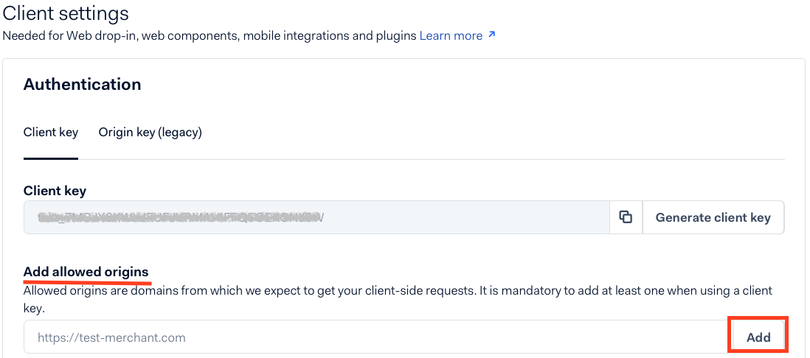
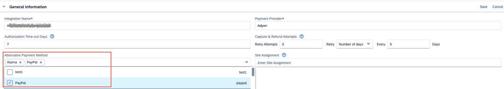
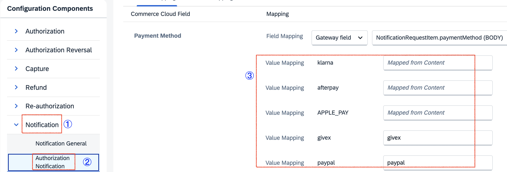

## Introduction ##
The Postman Collection enables the integration of Adyen for payment processing through open payment framework(OPF).

The integration supports:

* Authorization of Adyen payments using the OPF "Hosted Fields" UX pattern
* Deferred Capture support
* Refunds
* Reauthorization of saved payment

**In summary**: to import the [Adyen Hosted Fields Postman Collection](https://github.com/SAP-samples/open-payment-framework-integration) this page will guide you through the following steps: 

a) Create your Adyen test account.

b) Create an Adyen payment integration in OPF workbench.

c) Set up your Adyen test account to work with OPF.

d) Prepare the [Postman Environment](https://github.com/SAP-samples/open-payment-framework-integration) file so the collection can be imported with all your OPF tenant and Adyen test account unique values. 

e) Payment methods supported in OPF.

f) The language support in the Drop-in UI.

g) Validate the configuration in OPF workbench.

## Creating an Adyen Account ##

You can sign up for a free Adyen Test Account at https://www.adyen.com/signup and access it through https://ca-test.adyen.com/ca/ca/login.shtml.

## Creating an Adyen Payment Integration 

Create an Adyen payment integration in the OPF workbench. For detailed instructions, see [Creating Payment Integration
](https://help.sap.com/docs/OPEN_PAYMENT_FRAMEWORK/3580ff1b17144b8780c055bbb7c2bed3/20a64f954df1425391757759011e7e6b.html).

## Setting up Your Adyen Test Account to Work with OPF

   Once you have created you Adyen test account, do the following to set it up to work with OPF:

1. **Determine testing account structure**

   With Adyen, you have a single [company account](https://docs.adyen.com/account/account-structure/#company-account), and one or more sub-accounts called [merchant accounts](https://docs.adyen.com/account/account-structure/#company-account). Determine an initial structure for testing that will best represent what you will do once you are processing live. You will have another opportunity when going live to finalize your account structure.

3. **Create a user for yourself and your team members**

   You receive an admin user account for yourself when signing up. [Create additional users](https://docs.adyen.com/account/users/) for your team members as needed.

5. **Get API credentials** 

   Get your test API key and client key, which you'll need when building your integration. You can refer to [Create an API credential](https://docs.adyen.com/development-resources/api-credentials/#new-credential) for detailed instructions.

7. **Add payment methods**

   [Add the payment methods](https://docs.adyen.com/payment-methods/add-payment-methods/) you want to accept with your integration.

## Preparing the Postman environment_configuration file

**1. Token**

Get your access token by [creating an external app](https://help.sap.com/docs/OPEN_PAYMENT_FRAMEWORK/8ccca5bb539a49258e924b467ee4e1c2/d927d21974fe4b368e063f72733bf0fe.html) and [making authorized API calls](https://help.sap.com/docs/OPEN_PAYMENT_FRAMEWORK/8ccca5bb539a49258e924b467ee4e1c2/40c792e66e2942209dc853a43533d78d.html).

Copy the value of the access_token field (it’s a JWT) and set as the ``token`` value in the environment file.

**IMPORTANT**: Ensure the value is prefixed with **Bearer**. e.g. ``Bearer {{token}}``.

**2. Root url**

The ``rootUrl`` is the **BASE URL** of your OPF tenant.

E.g. if your workbench/OPF cockpit url was this …<https://opf-iss-d0.uis.commerce.stage.context.cloud.sap/opf-workbench>. The base Url would be https://opf-iss-d0.uis.commerce.stage.context.cloud.sap.

**3. Integration ID and Configuration ID**

The ``integrationId`` and ``configurationId`` values identify the payment integration and payment configuration, which can be found in the top left of your **Configuration Details** page in the OPF workbench.

* ``integrationId`` maps to ``accountGroupId`` in postman
* ``configurationId`` maps to ``accountId`` in postman

**4. merchantCode** 

You can obtain your merchant ID in the Adyen Dashboard.

**5. clientkey**

The client Key can be obtained in the Adyen dashboard. 

Go to **Developers -> API credentials -> ws User** to copy the ``Client Key``.

**6. nativeThreeDS**

Indicates if native 3D Secure authentication should be used when available.
Possible values:
preferred: Use native 3D Secure authentication when available.
disabled: Only use the redirect 3D Secure authentication flow.

**7. enableRecurring**

Payment details will be stored for recurring cardholder-not-present transactions only when both conditions are met:
`enableRecurring` is set to `true` and a valid `shopperReference` is provided
By default (`enableRecurring: false`), the system disables payment reauthorization.

**Note**

The client key is used to authenticate requests from your payment environment which renders inputs fields for card details
so there should be one or more allowed origins for client key.
Under "Add allowed origins", enter your domains and select "Add". then click the "Save changes" button.

## Summary

The environment file is now ready for importing into Postman together with the Mapping Configuration Collection file. Ensure you select the correct environment before running the collection.

## Allowlist

Depending on your environment, add the following domains to the domain allowlist in OPF workbench. For instructions, see [Adding Tenant-specific Domain to Allowlist
](https://help.sap.com/docs/OPEN_PAYMENT_FRAMEWORK/3580ff1b17144b8780c055bbb7c2bed3/a6836485b4494cfaad4033b4ee7a9c64.html).

``out.adyen.com``
``adyen.com``

## Adding a Standard Notification for Your Merchant Account

Go to the Adyen Dashboard to set up event notifications using the URL for Notification previsouly saved. For instructions, see <https://docs.adyen.com/issuing/set-up-webhooks/#configure-customer-area>.
    

## Editing the Postman Collection in the Postman App

   1. Import the two files at the same time to Postman.

   2. Make sure to select the environment for Adyen.

   3. Edit the Postman environment file so the collection can be imported with all your OPF Tenant and Adyen Test Account unique values.

| Name                                                                  | Description                                                                                                                                                                                                                                                                                                                                                                                                              
|-----------------------------------------------------------------------|--------------------------------------------------------------------------------------------------------------------------------------------------------------------------------------------------------------------------------------------------------------------------------------------------------------------------------------------------------------------------------------------------------------------------|
| token                                                                 | Get your access token by [creating an external app](https://help.sap.com/docs/OPEN_PAYMENT_FRAMEWORK/8ccca5bb539a49258e924b467ee4e1c2/d927d21974fe4b368e063f72733bf0fe.html) and [making authorized API calls](https://help.sap.com/docs/OPEN_PAYMENT_FRAMEWORK/8ccca5bb539a49258e924b467ee4e1c2/40c792e66e2942209dc853a43533d78d.html). **IMPORTANT**: Ensure the value is prefixed with Bearer. e.g. Bearer {{token}}. |
| rootURL                                                               | The ``rootUrl`` is the ``BASE URL`` of your OPF tenant.  E.g. if your workbench/OPF cockpit url was this … https://opf-iss-d0.uis.commerce.stage.context.cloud.sap/opf-workbench. The base Url would be: https://opf-iss-d0.uis.commerce.stage.context.cloud.sap.                                                                                                                                                        |
| service                                                               | The ``service`` is the name of your OPF service in specific environment. The value is ``opf`` by default.                                                                                                                                                                                                                                                                                                                |
| accountGroupId                                                        | Refers to the ``integrationId`` value that identifies the payment integration, which can be found in the top left of your configuration details page.                                                                                                                                                                                                                                                                    |
| accountId                                                             | Refers to the ``configurationId`` value that identifies the payment configuration, which can be found in the top left of your configuration details page.                                                                                                                                                                                                                                                                | 
| authentication_inbound_basic_auth_username                            | The username for notification basic authentication. You can self-define the value when **Adding a Standard Notification for Your Merchant Account** in the Adyen Dashboard. Go to **Developers** -> **Webhooks** to get the value.                                                                                                                                                                                       |
| authentication_inbound_basic_auth_password                            | The password for notification basic authentication. You can self-define the value when **Adding a Standard Notification for Your Merchant Account** in the Adyen Dashboard. Go to **Developers** -> **Webhooks** to get the value.                                                                                                                                                                                       |
| capturePattern                                                        | ``CAPTURE_PER_SHIPMENT``                                                                                                                                                                                                                                                                                                                                                                                                 |
| supportOverCapture                                                    | ``true``                                                                                                                                                                                                                                                                                                                                                                                                                 |
| enableOverCapture                                                     | ``true``                                                                                                                                                                                                                                                                                                                                                                                                                 |
| authorizationTimeoutDays                                              | 7                                                                                                                                                                                                                                                                                                                                                                                                                        |
| authentication_outbound_api_key_value_export                          | The Webservice User API key. Go to **Developers** -> **API credentials** -> **ws User** -> **Authentication** to get the value.                                                                                                                                                                                                                                                                                          |
| googlePayGateway                                                      | ``Adyen``  this is only for OPF Quick Buy function                                                                                                                                                                                                                                                                                                                                                                       | 
| checkoutPaymentHost                                                   | ``checkout-test.adyen.com``                                                                                                                                                                                                                                                                                                                                                                                              |
| merchantCode                                                          | You can obtain your merchant ID in the Adyen Dashboard.                                                                                                                                                                                                                                                                                                                                                                  |
| serviceVersion                                                        | v71                                                                                                                                                                                                                                                                                                                                                                                                                      |
| clientKey                                                             | Go to **Developers** -> **API credentials** -> **ws User** to copy Client Key.                                                                                                                                                                                                                                                                                                                                           |
| checkoutShopperHost                                                   | ``checkoutshopper-test.cdn.adyen.com``                                                                                                                                                                                                                                                                                                                                                                                   |
| mode                                                                  | ``test``                                                                                                                                                                                                                                                                                                                                                                                                                 |
| sdkVersion                                                            | ``6.5.1 this is the version of Web Drop-in``                                                                                                                                                                                                                                                                                                                                                                             |
| nativeThreeDS                                                         | ``preferred``                                                                                                                                                                                                                                                                                                                                                                                                            |
| notificationHmacKey                                                   | The Notification HMAC, which is used for Hosted Field notification signature. Go to **Developers** ->  **Webhooks** to get the value.                                                                                                                                                                                                                                                                                    |
| applePay**                                                            | These parameters are for the OPF Quick Buy function. If you prefer to use the Apple payment method within the Adyen Web Drop-in, please leave these items unchanged and ensure they are unselected in your Postman collection.                                                                                                                                                                                           |
| enableRecurring                                                       | ``false``  the payment details will not be stored for recurring payments where the shopper is not present, such as subscription or automatic top-up payments                                                                                                                                                                                                                                                             |
      
   4. Save and run the Postman collection.

## Payment methods supported in OPF:

a) The list of the default support Card types in OPF

* American Express
* Diners
* Discover
* Maestro
* Mastercard
* Switch
* Visa
* JCB
* CHINA UNION PAY

For other card types ,you need contact SAP OPF support team to add the new Card type.

b) Alternative Payment Method

OPF supports  lots of  APMs ,such as `paypal` `klarna` `afterpay`. However, these APMs are not automatically activated upon importing Postman collections. Instead, you'll need to carry out the following steps in your OPF workbench:

Step 1:
Create the APM in your OPF workbench by following this [help Portal](https://help.sap.com/docs/OPEN_PAYMENT_FRAMEWORK/8ccca5bb539a49258e924b467ee4e1c2/45767bd743cc45d79f2840a549bd490c.html)

Step 2:
Go to your configuration , Edit the "Alternative Payment Method" under the "General Information" Area :

Step 3:
Check if the APM is mapped rightly in Configuration Components (Notification)

## The language support in the Drop-in UI
Default support languages are:

* en-US
* zh-CN
* ja-JP
* de-DE

If the required language is not in the default list, you need to:
1. Check if the required language is available in the [Adyen Document](https://github.com/Adyen/adyen-web/tree/main/packages/server/translations).
2. Add the required language to the workbench of OPF:
   Go to Configuration Details -> Authorization -> Payment Form Configuration Scripts, then add it into the languageMap.

## Validating the Configuration in OPF Workbench

   1. Log in to the OPF workbench.
   2. Click **Payment Integrations** in the left navigation bar.
   3. Navigate to **Payment Integrations** -> **(your Adyen integration)** -> **Integration Details**.
   4. In the **Configuration section**, click **Show Details** to go to the configuration details page.
   5. In the **Settlement Method** section, make sure the right option is selected depending on your integration.
   6. In the **Authorization** section, click **Edit** to go to the authorization details page.
   7. In **Authorization** -> **Front-end component configuration**, make sure the Payment Form is the one corresponding to your integration.
