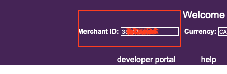
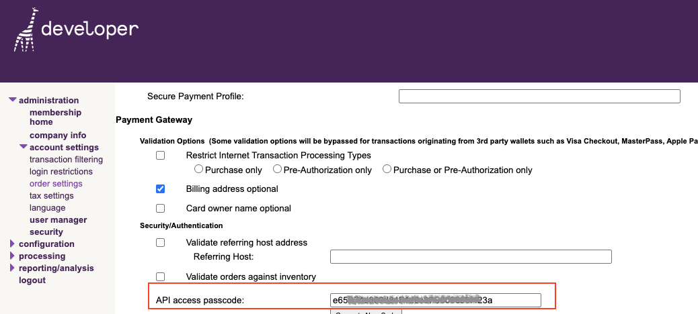
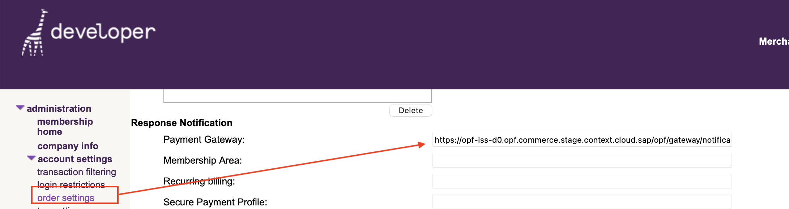

## Introduction ##
This Postman Collection aids in integrating [bambora for North America](https://dev.na.bambora.com/docs/references/custom_checkout/) into the Open Payment Framework (OPF).

The integration supports:

* Authorize card using Hosted Fields
* Reversal before Settlement.
* Settlement.
* Refund.

## Setup Instructions

### Overview
To import the [bambora Custom Checkout ](mapping_configuration.json) this page will take you through the following steps:

a) Create your bambora Account

b) Create a payment integration in OPF workbench.

c) Prepare the [Postman Environment](environment_configuration.json) file so the collection can be imported with all your OPF Tenant and bambora Demo Account unique values.

### Create your bambora Account

You can sign up for a free bambora Sandbox account [here](https://dev.na.bambora.com/docs/sign_up/) 

### Creating Payment Integration
Create a new integration in the OPF workbench and set the Merchant ID. For reference, see [Creating Payment Integration](https://help.sap.com/docs/OPEN_PAYMENT_FRAMEWORK/3580ff1b17144b8780c055bbb7c2bed3/20a64f954df1425391757759011e7e6b.html).

**Note**
In step 6:
a) The ``Merchnat ID`` can be retrieved from your bambora test account.

b) If you select ``Immediate Capture`` as the capture method, which means auto capture (settlement), then you need to update the``preAuth`` variable in the Postman environment to ``true`` in a later step.

### Preparing the Postman environment_configuration file

**1. Token**

Get your access token by [creating an external app](https://help.sap.com/docs/OPEN_PAYMENT_FRAMEWORK/8ccca5bb539a49258e924b467ee4e1c2/d927d21974fe4b368e063f72733bf0fe.html) and [making authorized API calls](https://help.sap.com/docs/OPEN_PAYMENT_FRAMEWORK/8ccca5bb539a49258e924b467ee4e1c2/40c792e66e2942209dc853a43533d78d.html).

Copy the value of the access_token field (it’s a JWT) and set as the ``token`` value in the environment file.

IMPORTANT: Ensure the value is prefixed with **Bearer**. e.g. ``Bearer {{token}}``.

**2. Root url**

The ``rootUrl`` is the **BASE URL** of your OPF tenant.

E.g. if your workbench/OPF cockpit url was this …

<https://opf-iss-d0.uis.commerce.stage.context.cloud.sap/opf-workbench>.

The base Url would be

https://opf-iss-d0.uis.commerce.stage.context.cloud.sap.

**3. Integration ID and Configuration ID**

The ``integrationId`` and ``configurationId`` values identify the payment integration and payment configuration, which can be found in the top left of your **Configuration Details** page in the OPF workbench.

* ``integrationId`` maps to ``accountGroupId`` in Postman
* ``configurationId`` maps to ``accountId`` in Postman

**4. apiPasscode**

This code is used for the authorization header in your API request.
You can retrieve this code in the [Member Area](https://web.na.bambora.com/). Click ``administration``, then ``account settings``, and then ``order settings``, under ``Payment Gateway`` :

**5. preAuth**

Set to ``false`` for Pre-Authorize, and ``true`` to complete a payment.
Default value is ``false``, If you select ``Immediate Capture`` as the capture method, Please make it as ``true``.

### Allowlist

Add the following domains to the domain allowlist in OPF workbench. For instructions, see [Adding Tenant-specific Domain to Allowlist
](https://help.sap.com/docs/OPEN_PAYMENT_FRAMEWORK/3580ff1b17144b8780c055bbb7c2bed3/a6836485b4494cfaad4033b4ee7a9c64.html).

``na.bambora.com``

### Adding a Standard Notification for Your Merchant Account

The callback URL is set in the [Member Area](https://web.na.bambora.com/admin/sDefault.asp). Click administration, then account settings, and then order settings, under Response Notification.

### Summary

The environment file is now ready for importing into Postman together with the Mapping Configuration Collection file. Ensure you select the correct environment before running the collection.

In summary, you should have edited the following variables:

#### Common
- ``token``
- ``rootUrl``
- ``accountGroupId``
- ``accountId``

#### bambora Specific
- ``apiPasscode``

For sandbox testing, all other values can be left as defaults.  

  
