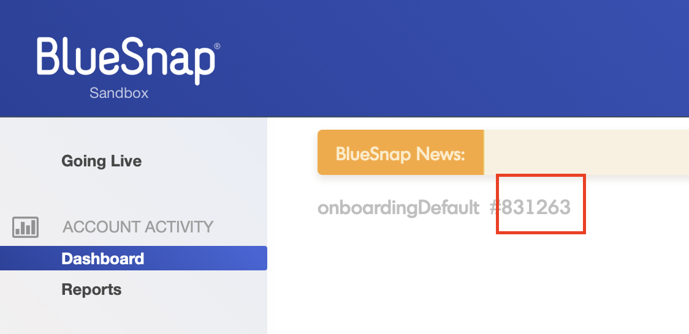
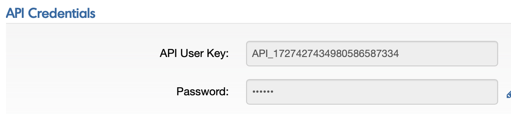
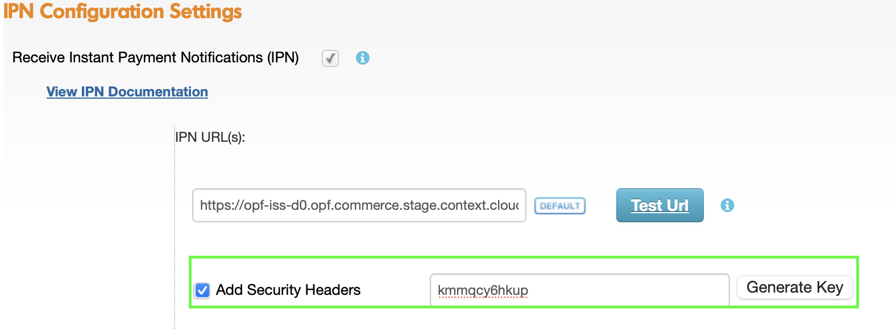

## Introduction ##
This Postman Collection aids in integrating [BlueSnap](https://support.bluesnap.com) into the Open Payment Framework (OPF).

The integration supports:

* Authorize card using Hosted Fields
* Settlement
* Refund
* Reversal

### In summary ###
In summary, to import the [Postman Collection](mapping_configuration.json), this page will guide you through the following steps:

a) Create your BlueSnap test account.

b) Create a BlueSnap payment integration in OPF.

c) Get the credentials for your BlueSnap integration.

d) Prepare the [Postman Environment](environment_configuration.json) file so the collection can be imported with all your OPF Tenant and BlueSnap Test Account unique values. 

### Creating a BlueSnap Account ###
You can sign up for a free BlueSnap test account at [Create your BlueSnap test account](https://sandbox.bluesnap.com/jsp/onboarding/index.jsp).

### Creating a BlueSnap Payment Integration ###
Create a BlueSnap payment integration in the OPF workbench. For reference, see [Creating Payment Integration
](https://help.sap.com/docs/OPEN_PAYMENT_FRAMEWORK/3580ff1b17144b8780c055bbb7c2bed3/20a64f954df1425391757759011e7e6b.html).

**Note**:

The Merchant ID is the Customer ID found in the header of BlueSnap Backoffice.

### Get the credentials for your BlueSnap integration ###

Refer to this [document](https://developers.bluesnap.com/reference/api-credentials) to get your API credentials.

### Preparing the Postman environment_configuration file ###

**1. Token**

Get your access token by [creating an external app](https://help.sap.com/docs/OPEN_PAYMENT_FRAMEWORK/8ccca5bb539a49258e924b467ee4e1c2/d927d21974fe4b368e063f72733bf0fe.html) and [making authorized API calls](https://help.sap.com/docs/OPEN_PAYMENT_FRAMEWORK/8ccca5bb539a49258e924b467ee4e1c2/40c792e66e2942209dc853a43533d78d.html).

Copy the value of the access_token field (it’s a JWT) and set as the ``token`` value in the environment file.

**IMPORTANT**: Ensure the value is prefixed with **Bearer**. e.g. ``Bearer {{token}}``.

**2. Root url**

The ``rootUrl`` is the **BASE URL** of your OPF tenant.

E.g. if your workbench/OPF cockpit url was this …

<https://opf-iss-d0.uis.commerce.stage.context.cloud.sap/opf-workbench>.

The base Url would be

https://opf-iss-d0.uis.commerce.stage.context.cloud.sap.

**3. Integration ID and Configuration ID**

The ``integrationId`` and ``configurationId`` values identify the payment integration and payment configuration, which can be found in the top left of your **Configuration Details** page in the OPF workbench.

* ``integrationId`` maps to ``accountGroupId`` in Postman
* ``configurationId`` maps to ``accountId`` in Postman

**4. authentication_outbound_basic_auth_username_export_452 and authentication_outbound_basic_auth_password_export_452**

You can fetch both values from your API credentials:

the value of ``authentication_outbound_basic_auth_username_export_452`` maps to the value of ``API User key``
the value of ``authentication_outbound_basic_auth_password_export_452`` maps to the value of ``Password``

**5. allow3DS2**

Default value is false , before you enable 3D Secure by setting this variable as true, making sure you have the following requirements :

 BlueSnap enables 3DS for your account. if not , please contact [Merchant Support](https://bluesnap.zendesk.com/hc/en-us/requests/new?ticket_form_id=360000127087)
 3D Secure Settings: In your Merchant Portal to the 3D Secure Rules section under Settings > Fraud Settings, then Enable 3D Secure.

**Note**:

3D Secure requires shopper's email address and  at least one phone number (work , home or mobile).
more information , please refer to this link :https://developers.bluesnap.com/reference/3-d-secure-for-api#supported-3d-secure-object-properties

**6. webhookSecretKey**

In the Merchant Portal, go to Settings > IPN Settings:

In the IPN URL(s) field, enter the Notification URL from OPF workbench where you want to receive the IPNs from BlueSnap
Then you can add an encryption key by using the Generate Key button to create one or by entering your own key in the field.

**7. apiEnv**

``pay.bluesnap.com`` for production script element

``sandpay.bluesnap.com`` for sandbox script element

### Allowlist
Add the following domains to the domain allowlist in OPF workbench. For instructions, see [Adding Tenant-specific Domain to Allowlist
](https://help.sap.com/docs/OPEN_PAYMENT_FRAMEWORK/3580ff1b17144b8780c055bbb7c2bed3/a6836485b4494cfaad4033b4ee7a9c64.html).

``ws.bluesnap.com`` for production account

``sandbox.bluesnap.com`` for test account

### Summary

The environment file is now ready for importing into Postman together with the Mapping Configuration Collection file. Ensure you select the correct environment before running the collection.

In summary, you should have edited the following variables: 

#### Common
- ``token``
- ``rootUrl``
- ``accountGroupId``
- ``accountId`` 

#### BlueSnap Specific
- ``authentication_outbound_basic_auth_username_export_452``
- ``authentication_outbound_basic_auth_password_export_452``
- ``webhookSecretKey``
  
