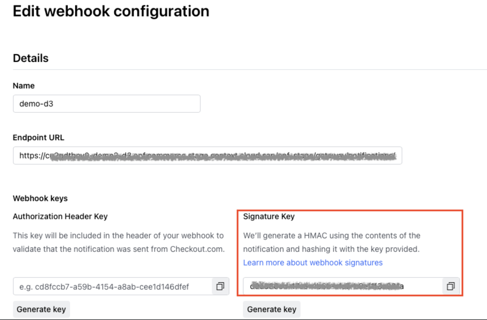

## Introduction ##
This Postman Collection aids in integrating [Checkout.com Payment gateway](https://www.checkout.com/docs) into the Open Payment Framework (OPF).

The integration supports:

* Authorize card using Hosted Fields (Frames)
* Settlement - Delayed Capture Pattern
* Refund
* Reversal
* Reauthorization
* Notifications - Authorization

### In summary ###
In summary, to import the [Postman Collection](mapping_configuration.json), this page will guide you through the following steps:

a) Create your checkout.com test account.

b) Create a checkout.com payment integration in OPF workbench.

c) Set up your checkout.com test account to work with OPF.

d) Prepare the [Postman Environment](environment_configuration.json) file so the collection can be imported with all your OPF Tenant and checkout.com Test Account unique values. 

### Creating a checkout.com Account ###
You can sign up for a free checkout.com test account at https://www.checkout.com/get-test-account.

### Creating a checkout.com Payment Integration ###
Create a checkout.com payment integration in the OPF workbench. For reference, see [Creating Payment Integration
](https://help.sap.com/docs/OPEN_PAYMENT_FRAMEWORK/3580ff1b17144b8780c055bbb7c2bed3/20a64f954df1425391757759011e7e6b.html).

### Setting up Your checkout.com Test Account to work with OPF ###
Once you have created you checkout.com test account,do the following to set it up to work with OPF:
1. **Please refer to this [API keys](https://www.checkout.com/docs/developer-resources/api/manage-api-keys/api-keys) document to create your public key and secret key.**

   **public key** is used for client-side authentication,here we use it as **merchantID** in OPF.
   
   **secret key** is used for server-to-server authentication and is supported across most of our endpoints.

2. **Webhook for notification**

   **There are two ways to create a workflow to start receiving webhook notifications:**

   ***a. can use checkout.com [Workflows API](https://www.checkout.com/docs/developer-resources/webhooks/manage-webhooks#Add_a_new_workflow)*** to create a workflow by specifying both the events you would like to subscribe to and the necessary configurations for the webhook workflow action.

   ***b. can use the [Dashboard](https://dashboard.checkout.com/) create a webhook workflow, you can refer [Create a webhook](https://www.checkout.com/docs/business-operations/use-the-dashboard/developers/webhooks#Create_a_webhook)***

   **Note**:
   1. When you create webhook via API, remember put the "Authorization" with Secret key value in the header.

   2. The URL address in both ways is fetched from our OPF workbench: Notification URL.

### Preparing the Postman environment_configuration file ###

**1. Token**

Get your access token by [creating an external app](https://help.sap.com/docs/OPEN_PAYMENT_FRAMEWORK/8ccca5bb539a49258e924b467ee4e1c2/d927d21974fe4b368e063f72733bf0fe.html) and [making authorized API calls](https://help.sap.com/docs/OPEN_PAYMENT_FRAMEWORK/8ccca5bb539a49258e924b467ee4e1c2/40c792e66e2942209dc853a43533d78d.html).

Copy the value of the access_token field (it’s a JWT) and set as the ``token`` value in the environment file.

**IMPORTANT**: Ensure the value is prefixed with **Bearer**. e.g. ``Bearer {{token}}``.

**2. Root url**

The ``rootUrl`` is the **BASE URL** of your OPF tenant.

E.g. if your workbench/OPF cockpit url was this …

<https://opf-iss-d0.uis.commerce.stage.context.cloud.sap/opf-workbench>.

The base Url would be

https://opf-iss-d0.uis.commerce.stage.context.cloud.sap.

**3. Integration ID and Configuration ID**

The ``integrationId`` and ``configurationId`` values identify the payment integration and payment configuration, which can be found in the top left of your **Configuration Details** page in the OPF workbench.

* ``integrationId`` maps to ``accountGroupId`` in postman
* ``configurationId`` maps to ``accountId`` in postman

**4. authentication_outbound_api_key_value_export_172**

The value of this Variable is the **Secret (or Private) Key** which you have done in dashboard of checkout.com. If you haven't completed this step, please go to the [dashboard](https://dashboard.checkout.com/) to create the value. In Test environment, it starts with **sk_sbox**.

* Set Secret key prefixed with **Bearer** as **value** for environment variable  ``authentication_outbound_api_key_value_export_172``.

**5. apiKey**

The value of API key is the public key which you obtained in dashboard of checkout.com. If you haven't completed this step, please go to the [dashboard](https://dashboard.checkout.com/) to create the value. In Test environment, it starts with **pk_sbox**.

Replace the ``apiKey`` variable value in the environment file with this value starting with **pk_sbox**.

**6. processing_channel_id**
This parameter is requested during payment flow
To find the ``processing_channel_id`` in the  [Dashboard](https://dashboard.checkout.com/):
1. Login to the Dashboard.
2. Go to the **Developers** tab.
3. Open the **Keys** page.
4. Either use the button to Create a new key or edit one of the existing keys.

You will see a list of the processing channels with their corresponding IDs when you access the key details.

**7. authentication_inbound_hmac_signature_calculation_secret_export_177**

   **Find your webhook configuration under the webhook tab**

   

   **Get your Signature key under this webhook configuration**

   

### Allowlist
Add the following domains to the domain allowlist in OPF workbench. For instructions, see [Adding Tenant-specific Domain to Allowlist
](https://help.sap.com/docs/OPEN_PAYMENT_FRAMEWORK/3580ff1b17144b8780c055bbb7c2bed3/a6836485b4494cfaad4033b4ee7a9c64.html).

``api.sandbox.checkout.com`` for test

``api.checkout.com`` for production

### Summary

The environment file is now ready for importing into Postman together with the Mapping Configuration Collection file. Ensure you select the correct environment before running the collection.

In summary, you should have edited the following variables: 

#### Common
- ``token``
- ``rootUrl``
- ``accountGroupId``
- ``accountId`` 

#### checkout.com Specific
- ``apiKey``
- ``authentication_outbound_api_key_value_export_172``
- ``authentication_inbound_hmac_signature_calculation_secret_export_177``
- ``processing_channel_id`` 
  
