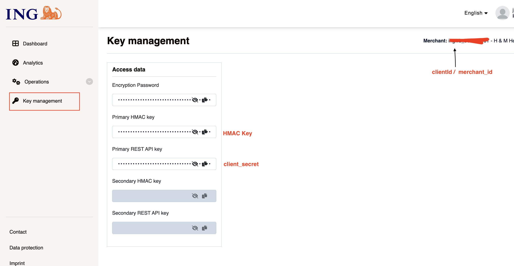

## Introduction ##
The Postman Collection enables the integration of [ING SmartCollect – Wero](https://www.ing.de/geschaeftskunden/zahlungsverkehr/wero/) for payment processing through Open Payment Framework (OPF).

The integration supports:

* Authorization of Wero payments with Auto Capture using the OPF "Payment Page" UX pattern
* Refunds
* Notifications (Webhooks)

**In summary**: to import the [ING SmartCollect Wero Postman Collection](mapping_configuration.json) this page will guide you through the following steps:

a) Create your ING SmartCollect test account.

b) Create an ING SmartCollect Wero payment integration in OPF workbench.

c) Set up your ING SmartCollect account to work with OPF.

d) Prepare the [Postman Environment](environment_configuration.json) file so the collection can be imported with all your OPF tenant and ING SmartCollect unique values.

e) Validate the configuration in OPF workbench.

## Creating an ING SmartCollect Account ##

Sign up for an ING SmartCollect merchant account at https://www.ing.de/geschaeftskunden/zahlungsverkehr/wero/ and access the merchant portal at https://portal.smartcollect.ing.com/Dashboard/Show where you can manage credentials, transactions.

## Creating an ING SmartCollect Wero Payment Integration ##

Create an ING SmartCollect Wero payment integration in the OPF workbench. For reference, see [Creating Payment Integration](https://help.sap.com/docs/OPEN_PAYMENT_FRAMEWORK/3580ff1b17144b8780c055bbb7c2bed3/20a64f954df1425391757759011e7e6b.html).

## Setting up Your ING SmartCollect Account to work with OPF ##

1. **Obtain Credentials from Key Management**

   In your ING SmartCollect merchant portal, navigate to the **Key Management** section at https://portal.smartcollect.ing.com/KeyManagement/Show and obtain the following:
   - **Client ID** — shown as `clientId / merchant_id` in the top-right of the page. Maps to `authentication_outbound_oauth2_client_id_export_1093` in Postman.
   - **Client Secret** — shown as **Primary REST API key** in the Access data section. Maps to `authentication_outbound_oauth2_client_secret_export_1093` in Postman.
   - **Webhook Secret** — shown as **Encryption Password** in the Access data section. OPF uses this to verify the `x-paygate-signature` header on incoming notifications. Set as `ingWebhookSecret` in the environment file.
   - **HMAC Key** — shown as **Primary HMAC key** in the Access data section. Set as `hmacKey` in the environment file.

   The OAuth2 token endpoint is: `https://api.smartcollect.ing.com/authorization/oauth/token`

   > **Note**: ING SmartCollect automatically sends transaction notifications to the webhook URL configured during authentication setup — no manual URL registration is required in the PSP portal.

   

## Preparing the Postman environment_configuration file ##

**1. Token**

Get your access token by [creating an external app](https://help.sap.com/docs/OPEN_PAYMENT_FRAMEWORK/8ccca5bb539a49258e924b467ee4e1c2/d927d21974fe4b368e063f72733bf0fe.html) and [making authorized API calls](https://help.sap.com/docs/OPEN_PAYMENT_FRAMEWORK/8ccca5bb539a49258e924b467ee4e1c2/40c792e66e2942209dc853a43533d78d.html).

Copy the value of the `access_token` field (it's a JWT) and set it as the `token` value in the environment file.

**IMPORTANT**: Ensure the value is prefixed with **Bearer**. e.g. `Bearer {{token}}`.

**2. Root URL**

The `rootUrl` is the **BASE URL** of your OPF tenant.

E.g. if your workbench/OPF cockpit URL was:

`https://opf-iss-d0.uis.commerce.stage.context.cloud.sap/opf-workbench`

The base URL would be:

`https://opf-iss-d0.uis.commerce.stage.context.cloud.sap`

**3. Integration ID and Configuration ID**

The `integrationId` and `configurationId` values identify the payment integration and payment configuration, which can be found in the top left of your **Configuration Details** page in the OPF workbench.

* `integrationId` maps to `accountGroupId` in Postman
* `configurationId` maps to `accountId` in Postman

**4. OAuth2 Credentials**

| Variable | Description |
| --- | --- |
| `authentication_outbound_oauth2_token_url_export_1093` | OAuth2 token endpoint: `https://api.smartcollect.ing.com/authorization/oauth/token` |
| `authentication_outbound_oauth2_client_id_export_1093` | Your ING SmartCollect OAuth2 Client ID |
| `authentication_outbound_oauth2_client_secret_export_1093` | Your ING SmartCollect OAuth2 Client Secret |
| `authentication_outbound_oauth2_use_basic_auth_export_1093` | Set to `false` |

**5. API Host Configuration**

| Variable | Description |
| --- | --- |
| `ingApiHost` | ING SmartCollect API host: `api.smartcollect.ing.com` |
| `ingApiBasePath` | API base path: `api/v2` |

**6. Notification / Webhook Secret**

Set `ingWebhookSecret` to the **Encryption Password** from the ING SmartCollect Key Management page. OPF uses this value to verify the inbound `x-paygate-signature` header on incoming notifications from ING SmartCollect.

**7. HMAC Key**

Set `hmacKey` to the HMAC key used for verifying notification signatures from ING SmartCollect.

**8. Capture and Authorization Settings**

| Variable | Value | Description |
| --- | --- | --- |
| `capturePattern` | `AUTO_CAPTURE` | Wero uses auto capture — no separate capture step |
| `enableOverCapture` | `false` | Over-capture not supported |
| `enableCaptureReAuth` | `false` | Capture re-auth not supported |
| `authorizationTimeoutDays` | `7` | Authorization validity period in days |

## Allowlist ##

Add the following domains to the domain allowlist in OPF workbench. For instructions, see [Adding Tenant-specific Domain to Allowlist](https://help.sap.com/docs/OPEN_PAYMENT_FRAMEWORK/3580ff1b17144b8780c055bbb7c2bed3/a6836485b4494cfaad4033b4ee7a9c64.html).

``api.smartcollect.ing.com``

## Editing the Postman Collection in the Postman App ##

1. Import both the environment and mapping configuration files at the same time into Postman.
2. Make sure to select the **ING SmartCollect Wero** environment before running.
3. Edit the Postman environment file with all your OPF tenant and ING SmartCollect unique values (see variable table in the Summary section below).
4. Save and run the Postman collection.

## Validating the Configuration in OPF Workbench ##

1. Log in to the OPF workbench.
2. Click **Payment Integrations** in the left navigation bar.
3. Navigate to **Payment Integrations** → **(your ING SmartCollect Wero integration)** → **Integration Details**.
4. In the **Configuration** section, click **Show Details** to go to the configuration details page.
5. In the **Settlement Method** section, verify that **Auto Capture** is populated.
6. In the **Authorization** section, click **Edit** and confirm the Payment Form corresponds to the Payment Page pattern.

## Summary ##

The environment file is now ready for importing into Postman together with the Mapping Configuration Collection file. Ensure you select the correct environment before running the collection.

In summary you should have edited the following variables:

| Variable | Description |
| --- | --- |
| `token` | OPF access token prefixed with `Bearer` |
| `rootUrl` | Base URL of your OPF tenant |
| `service` | OPF service name — `opf` by default |
| `accountGroupId` | OPF Integration ID (`integrationId`) |
| `accountId` | OPF Configuration ID (`configurationId`) |
| `authentication_outbound_oauth2_client_id_export_1093` | ING SmartCollect OAuth2 Client ID |
| `authentication_outbound_oauth2_client_secret_export_1093` | ING SmartCollect OAuth2 Client Secret |
| `ingWebhookSecret` | Webhook secret from ING SmartCollect Key Management |
| `hmacKey` | HMAC key for notification signature verification |

