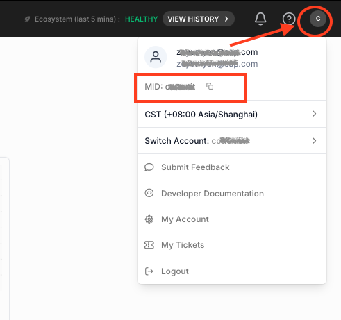
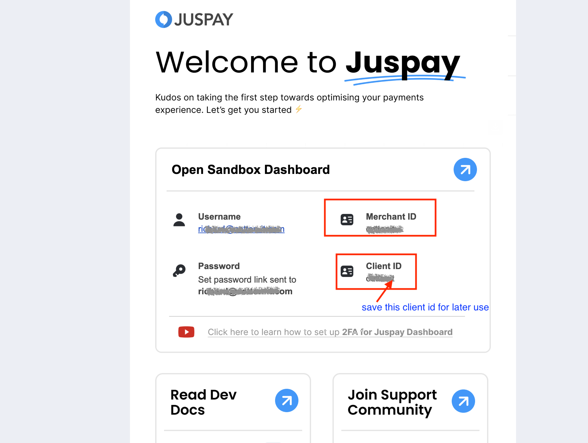
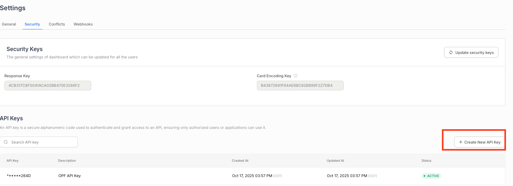
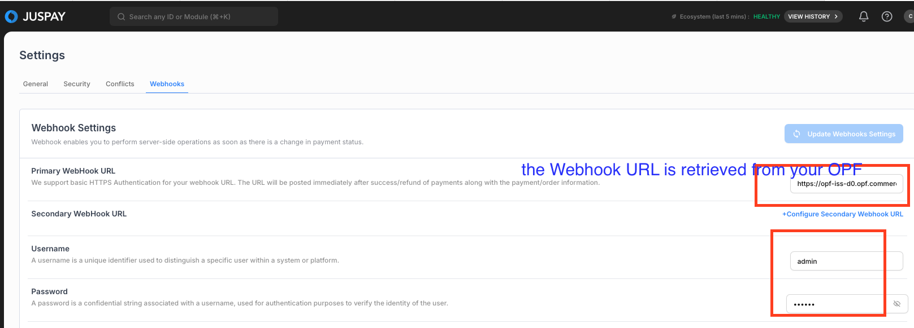

## Introduction

The Postman Collection enables a [Juspay Hypercheckout](https://juspay.io/in/docs/hyper-checkout/iframe-web/overview/integration-architecture) iFrame to be used to take payments through OPF. 

The integration supports:

* Authorization with auto capture
* Refund

## Setup Instructions

### Overview
To import the [Juspay Hypercheckout](mapping_configuration.json) this page will take you through the following steps:

a) Create your Juspay Account

b) Create a payment integration in OPF workbench.

c) Prepare the [Postman Environment](environment_configuration.json) file so the collection can be imported with all your OPF Tenant and Juspay Account unique values. 

### Create your Juspay Account

You can sign up for a free Juspay Sandbox account [here](https://portal.juspay.in/selfSignUp).

### Creating Payment Integration
Create a new integration in the OPF workbench and set the Merchant ID. For reference, see [Creating Payment Integration](https://help.sap.com/docs/OPEN_PAYMENT_FRAMEWORK/3580ff1b17144b8780c055bbb7c2bed3/20a64f954df1425391757759011e7e6b.html).

**Note**
a) In Step 6, regarding the ``Merchant ID``, you can retrieve it from your [Juspay DashBoard](https://portal.juspay.in/settings/Webhooks) by clicking the user icon on the top right. 

Alternatively, you can retrieve the ``Merchant ID`` from your welcome email sent by Juspay:

b) In Step 6, select ``Immediate Capture`` as the capture method.

### Preparing the Postman environment_configuration file

**1. Token**

Get your access token by [creating an external app](https://help.sap.com/docs/OPEN_PAYMENT_FRAMEWORK/8ccca5bb539a49258e924b467ee4e1c2/d927d21974fe4b368e063f72733bf0fe.html) and [making authorized API calls](https://help.sap.com/docs/OPEN_PAYMENT_FRAMEWORK/8ccca5bb539a49258e924b467ee4e1c2/40c792e66e2942209dc853a43533d78d.html).

Copy the value of the access_token field (it’s a JWT) and set as the ``token`` value in the environment file.

IMPORTANT: Ensure the value is prefixed with **Bearer**. e.g. ``Bearer {{token}}``.

**2. Root url**

The ``rootUrl`` is the **BASE URL** of your OPF tenant.

E.g. if your workbench/OPF cockpit url was this …

<https://opf-iss-d0.uis.commerce.stage.context.cloud.sap/opf-workbench>.

The base Url would be

https://opf-iss-d0.uis.commerce.stage.context.cloud.sap.

**3. Integration ID and Configuration ID**

The ``integrationId`` and ``configurationId`` values identify the payment integration and payment configuration, which can be found in the top left of your **Configuration Details** page in the OPF workbench.

* ``integrationId`` maps to ``accountGroupId`` in postman
* ``configurationId`` maps to ``accountId`` in postman

**4. API Credentials**

The Juspay API operates through an API key. The API key is unique for each account and environment (sandbox or production) and must be retrieved from the [Juspay DashBoard](https://portal.juspay.in/settings/Webhooks) by navigating to Payments -> Settings -> Security Tab.

*  ``API KEY`` maps to ``authentication_outbound_basic_auth_username_export_729`` in postman
*  Empty string for ``authentication_outbound_basic_auth_password_export_729`` in postman

**5. webhook**

After the completion of every payment or refund call, Juspay will provide direct notifications to OPF regarding events. You can configure webhooks in the [Juspay DashBoard](https://portal.juspay.in/settings/Webhooks) by navigating to Payments -> Settings -> Webhook Tab.

* ``Username`` maps to ``authentication_inbound_basic_auth_username_export_730`` in postman
* ``Password`` maps to ``authentication_inbound_basic_auth_password_export_730`` in postman

**Note**
You can follow this guide on [Configuring Webhooks](https://juspay.io/in/docs/resources/docs/common-resources/webhooks#Configuring-Webhooks) to finish the configuration in your Juspay dashboard.
If you do not receive any notification from Juspay, please contact the Juspay support team to whitelist the webhook domain.

**6. clientId**

Unique Client id shared during onboarding, you can retrieve the ``clientId`` from your welcome email sent by Juspay.

### Allowlist
Add the following domains to the domain allowlist in OPF workbench. For instructions, see [Adding Tenant-specific Domain to Allowlist
](https://help.sap.com/docs/OPEN_PAYMENT_FRAMEWORK/3580ff1b17144b8780c055bbb7c2bed3/a6836485b4494cfaad4033b4ee7a9c64.html).

``juspay.in``

### Summary

The environment file is now ready for importing into Postman together with the Mapping Configuration Collection file. Ensure you select the correct environment before running the collection.

In summary, you should have edited the following variables: 

#### Common
- ``token``
- ``rootUrl``
- ``accountGroupId``
- ``accountId``

#### Juspay Specific
- ``authentication_outbound_basic_auth_username_export_729``
- ``authentication_outbound_basic_auth_password_export_729``
- ``authentication_inbound_basic_auth_password_export_730``
- ``authentication_inbound_basic_auth_password_export_730``
- ``clientId``
  
For sandbox testing, all other values can be left as defaults.  

