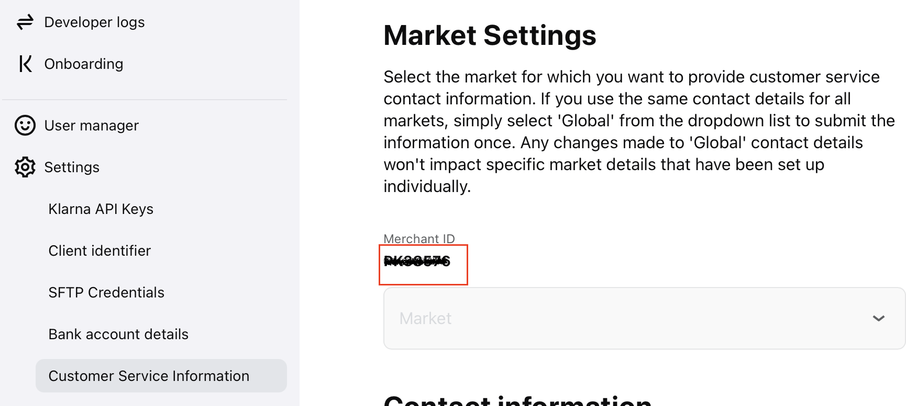
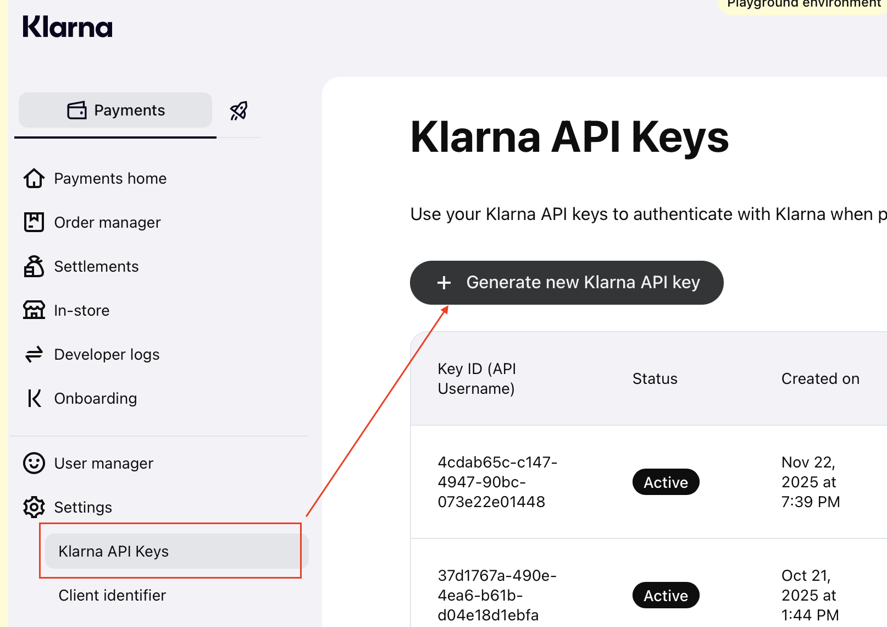
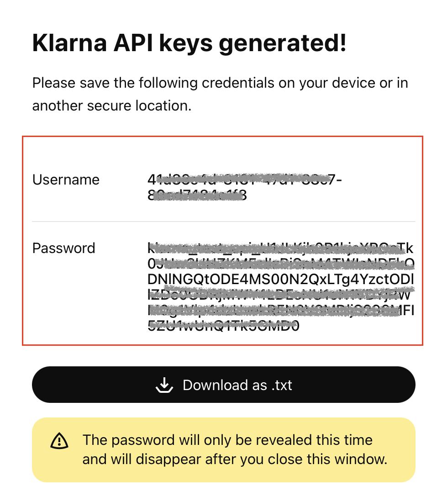
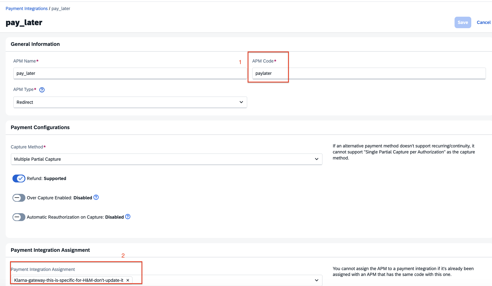
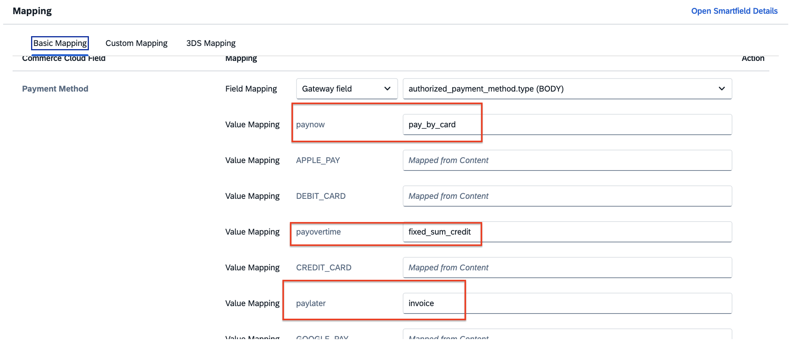

## Introduction

This Postman Collection enables the integration of Klarna for payment processing through the Open Payment Framework (OPF).

The integration supports:

* Authorization
* Capture
* Refunds
* Reversal

**In summary**: to import the [Postman Collection](mapping_configuration.json), this page will guide you through the following steps:

a) Create your Klarna test account.

b) Create a Klarna payment integration in the OPF workbench.

c) Prepare the [Postman Environment](environment_configuration.json) file so the collection can be imported with all your OPF tenant and Klarna test account unique values.

d) Create an APM for the Klarna configuration.

e) Validate the configuration in the OPF workbench.

## Creating a Klarna Account

You can sign up for a free Klarna test account at the [Sign-up Page](https://docs.klarna.com/resources/developer-tools/testing-payments/before-you-test/#accessing-the-test-merchant-portal-creating-a-new-test-account).

## Creating a Klarna Payment Integration

Create a Klarna payment integration in the OPF workbench. For detailed instructions, see [Creating Payment Integration](https://help.sap.com/docs/OPEN_PAYMENT_FRAMEWORK/3580ff1b17144b8780c055bbb7c2bed3/20a64f954df1425391757759011e7e6b.html).

For Step 6, you can retrieve your Merchant ID from the Klarna portal via **Settings > Customer Service**.

## Preparing Postman Environment Variables for OPF

**1. Token**

Get your access token by [creating an external app](https://help.sap.com/docs/OPEN_PAYMENT_FRAMEWORK/8ccca5bb539a49258e924b467ee4e1c2/d927d21974fe4b368e063f72733bf0fe.html) and [making authorized API calls](https://help.sap.com/docs/OPEN_PAYMENT_FRAMEWORK/8ccca5bb539a49258e924b467ee4e1c2/40c792e66e2942209dc853a43533d78d.html).

Copy the value of the `access_token` field (it's a JWT) and set it as the `token` value in the environment file.

**IMPORTANT**: Ensure the value is prefixed with **Bearer**. e.g. `Bearer {{token}}`.

**2. Root URL**

The `rootUrl` is the **base URL** of your OPF tenant.

e.g. if your OPF workbench/cockpit URL is `https://opf-iss-d0.uis.commerce.stage.context.cloud.sap/opf-workbench`, the base URL would be `https://opf-iss-d0.uis.commerce.stage.context.cloud.sap`.

**3. Integration ID and Configuration ID**

The `integrationId` and `configurationId` values identify the payment integration and payment configuration, which can be found in the top left of the **Configuration Details** page in the OPF workbench.

* `integrationId` maps to `accountGroupId` in Postman
* `configurationId` maps to `accountId` in Postman

**4. Credentials for Basic Authorization**

Use your Klarna API keys to authenticate with Klarna when placing orders. You can retrieve the keys from the Klarna portal via **Settings > Klarna API Keys**.

Click the **Generate new Klarna API Key** button.

Map the following values in the Postman environment:

* `Username` maps to `authentication_outbound_basic_auth_username_export_873` in Postman
* `Password` maps to `authentication_outbound_basic_auth_password_export_873` in Postman

**5. Intent**

Enum: `"buy"` `"tokenize"` `"buy_and_tokenize"`

The intent for the session. This field is designed to inform Klarna of the purpose of the customer's session.

**6. customPaymentMethodId**

Promo codes — this array can be used to define which of the configured payment options within a payment category (e.g. `pay_later`, `pay_over_time`) should be shown for this purchase.

Run this Postman collection file to import the Klarna configurations into your OPF workbench.

## Create APM for Klarna Configuration

You need to create 3 APMs (Pay Now, Pay Later, Pay Over Time) in your OPF workbench by following the [Help Portal](https://help.sap.com/docs/OPEN_PAYMENT_FRAMEWORK/8ccca5bb539a49258e924b467ee4e1c2/45767bd743cc45d79f2840a549bd490c.html), then assign them to your Klarna configuration.

Please note:

1. The APM Code of your APM configuration must be:
   * `paynow` for Pay Now
   * `paylater` for Pay Later
   * `payovertime` for Pay Over Time

   Otherwise, those payment methods will be missing from your Klarna Authorization configuration, and you will need to configure them manually based on the [Klarna documentation](https://docs.klarna.com/acquirer/klarna/web-payments/additional-resources/payment-method-grouping/).

2. Make sure you have assigned your payment integration. Only after this step will you be able to find the payment method mapping in your Authorization configuration. (Navigate to the Response Mapping of **Direct Payment Request** or **Payment Submit Complete Call**.)

## Allowlist

Depending on your environment, add the following domains to the domain allowlist in the OPF workbench. For instructions, see [Adding Tenant-specific Domain to Allowlist](https://help.sap.com/docs/OPEN_PAYMENT_FRAMEWORK/3580ff1b17144b8780c055bbb7c2bed3/a6836485b4494cfaad4033b4ee7a9c64.html).

**Testing (Playground)**

| Domain | Region |
|---|---|
| `api.playground.klarna.com` | Europe |
| `api-na.playground.klarna.com` | North America |
| `api-oc.playground.klarna.com` | Oceania |

**Live (Production)**

| Domain | Region |
|---|---|
| `api.klarna.com` | Europe |
| `api-na.klarna.com` | North America |
| `api-oc.klarna.com` | Oceania |

## Summary

The environment file is now ready to import into Postman. Make sure you have enabled the environment for this configuration, then save and run the collection.

## Validating the Configuration in OPF Workbench

1. Log in to the OPF workbench.
2. Click **Payment Integrations** in the left navigation bar.
3. Navigate to **Payment Integrations** → **(your Klarna integration)** → **Integration Details**.
4. In the **Configuration** section, click **Show Details** to go to the configuration details page.
5. In the **Settlement Method** section, make sure the correct option is selected for your integration.
6. In the **Authorization** section, click **Edit** to go to the authorization details page.
7. In **Authorization** → **Front-end component configuration**, make sure the Payment Form corresponds to your integration.
