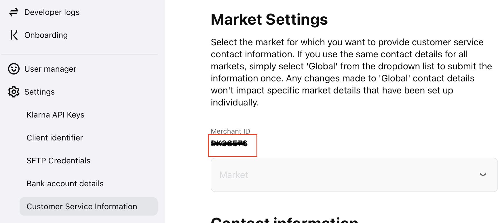
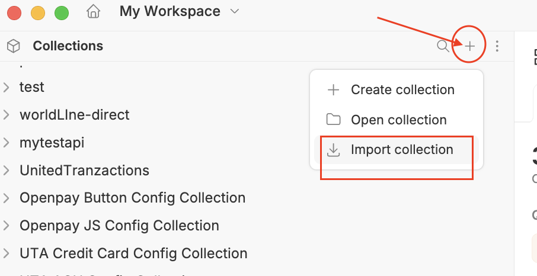
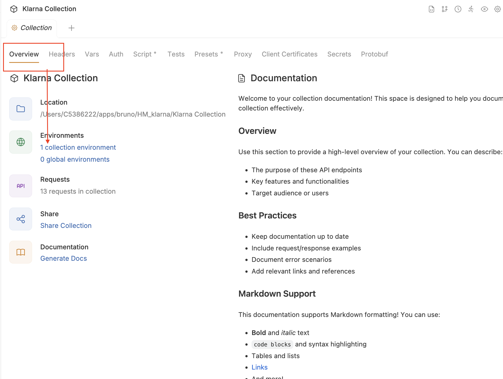
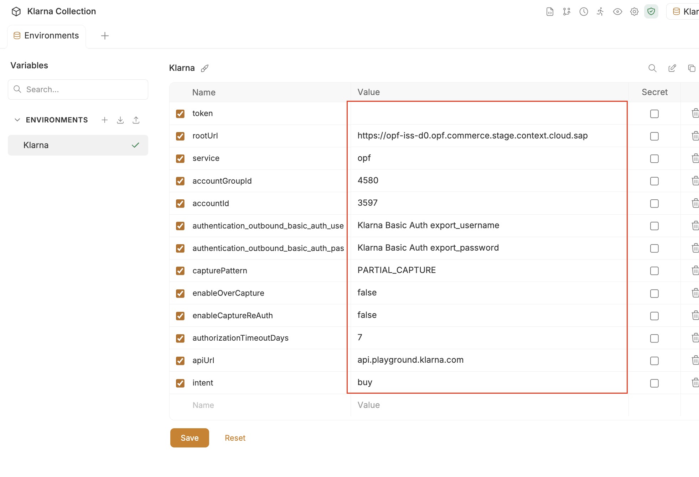
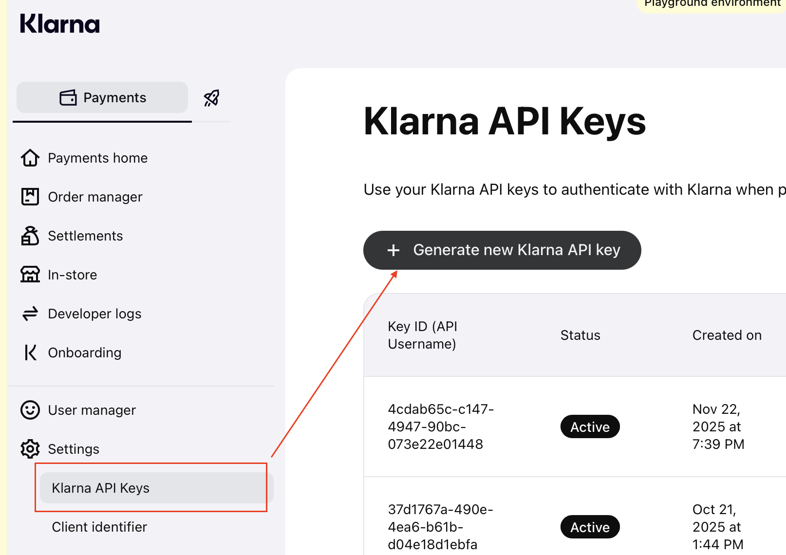
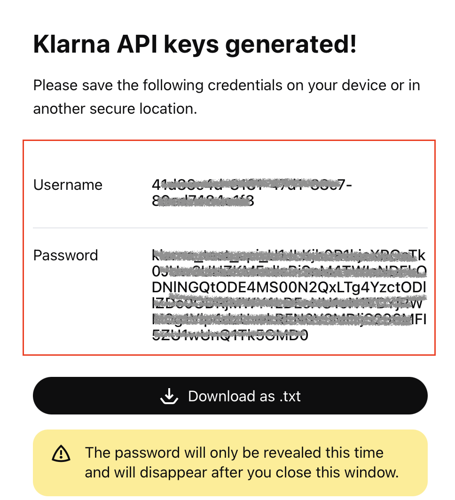
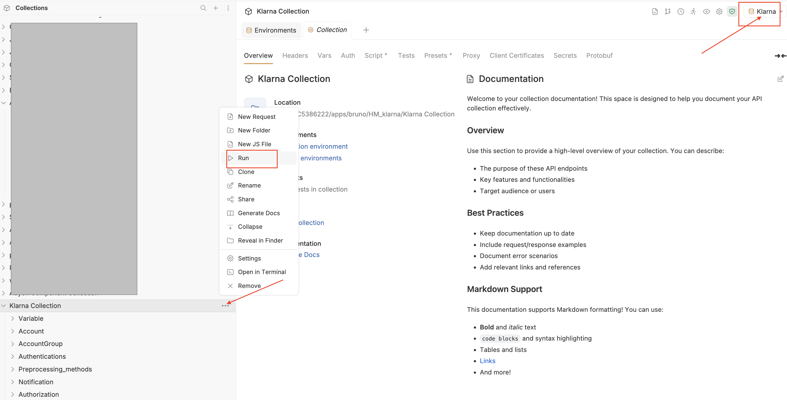

## Introduction ##
The  Bruno Collection enables the integration of Klarna for payment processing through open payment framework(OPF).
please make sure the version of Bruno is 3.1.4 or above.

The integration supports:

* Authorization.
*  Capture 
* Refunds
* Reversal

**In summary**: to import the [Klarna  Bruno Collection](https://github.com/SAP-samples/open-payment-framework-integration) this page will guide you through the following steps: 

a) Create your Klarna test account.

b) Create an Klarna payment integration in OPF workbench.

c) Preparing  Bruno Environment Variables  so the collection can be imported with all your OPF tenant and Klarna test account unique values. 

d) Validate the configuration in OPF workbench.

## Creating an Klarna Account ##

You can sign up for a free Klarna Test Account at [Sign-up Page](https://docs.klarna.com/resources/developer-tools/testing-payments/before-you-test/#accessing-the-test-merchant-portal-creating-a-new-test-account).

## Creating an Klarna Payment Integration 

Create an Klarna payment integration in the OPF workbench. For detailed instructions, see [Creating Payment Integration
](https://help.sap.com/docs/OPEN_PAYMENT_FRAMEWORK/3580ff1b17144b8780c055bbb7c2bed3/20a64f954df1425391757759011e7e6b.html).

For Step 6, you can retrieve your Merchant ID from the Klarna portal via Settings > Customer Service.

## Preparing  Bruno Environment Variables For your  OPF

Open Bruno and import this Bruno collection file into your workspace.

Next, open the Environment configuration.

Then update the variable values according to the following instructions:

**1. Token**

Get your access token by [creating an external app](https://help.sap.com/docs/OPEN_PAYMENT_FRAMEWORK/8ccca5bb539a49258e924b467ee4e1c2/d927d21974fe4b368e063f72733bf0fe.html) and [making authorized API calls](https://help.sap.com/docs/OPEN_PAYMENT_FRAMEWORK/8ccca5bb539a49258e924b467ee4e1c2/40c792e66e2942209dc853a43533d78d.html).

Copy the value of the access_token field (it’s a JWT) and set as the ``token`` value in the environment file.

**IMPORTANT**: Ensure the value is prefixed with **Bearer**. e.g. ``Bearer {{token}}``.

**2. Root url**

The ``rootUrl`` is the **BASE URL** of your OPF tenant.

E.g. if your workbench/OPF cockpit url was this …<https://opf-iss-d0.uis.commerce.stage.context.cloud.sap/opf-workbench>. The base Url would be https://opf-iss-d0.uis.commerce.stage.context.cloud.sap.

**3. Integration ID and Configuration ID**

The ``integrationId`` and ``configurationId`` values identify the payment integration and payment configuration, which can be found in the top left of your **Configuration Details** page in the OPF workbench.

* ``integrationId`` maps to ``accountGroupId`` in postman
* ``configurationId`` maps to ``accountId`` in postman

**4. Credentials for basic authorization**

Use your Klarna API keys to authenticate with Klarna when placing orders, you can get the keys from the Klarna portal via Settings > Klarna API Keys

Then click "Generate new Klarna API Key" button

And map follow values for Bruno environment :

* ``Username`` maps to ``authentication_outbound_basic_auth_username_export_873`` in Bruno
* ``Password`` maps to ``authentication_outbound_basic_auth_password_export_873`` in Bruno

**5.intent**

Enum: "buy" "tokenize" "buy_and_tokenize"
Intent for the session. The field is designed to let partners inform Klarna of the purpose of the customer’s session

***6.customPaymentMethodId*

Promo codes - The array could be used to define which of the configured payment options within a payment category (pay_later, pay_over_time, etc.) should be shown for this purchase.

## Allowlist

Depending on your environment, add the following domains to the domain allowlist in OPF workbench. For instructions, see [Adding Tenant-specific Domain to Allowlist
](https://help.sap.com/docs/OPEN_PAYMENT_FRAMEWORK/3580ff1b17144b8780c055bbb7c2bed3/a6836485b4494cfaad4033b4ee7a9c64.html).

Testing(playground)
``api.playground.klarna.com`` for Europe
``api-na.playground.klaran.com`` for North America
``api-oc.playground.klaran.com`` for Oceania

Live(production)
``api.klarna.com`` for Europe
``api-na.klaran.com`` for North America
``api-oc.klaran.com`` for Oceania

## Summary
The environment file is now ready to import into Bruno. Make sure you have enabled the environment for this configuration, then save and run the collection:

## Validating the Configuration in OPF Workbench

   1. Log in to the OPF workbench.
   2. Click **Payment Integrations** in the left navigation bar.
   3. Navigate to **Payment Integrations** -> **(your Klarna integration)** -> **Integration Details**.
   4. In the **Configuration section**, click **Show Details** to go to the configuration details page.
   5. In the **Settlement Method** section, make sure the right option is selected depending on your integration.
   6. In the **Authorization** section, click **Edit** to go to the authorization details page.
   7. In **Authorization** -> **Front-end component configuration**, make sure the Payment Form is the one corresponding to your integration.
