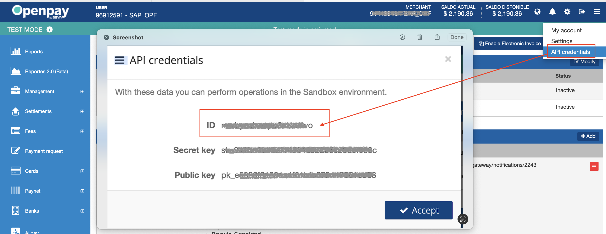
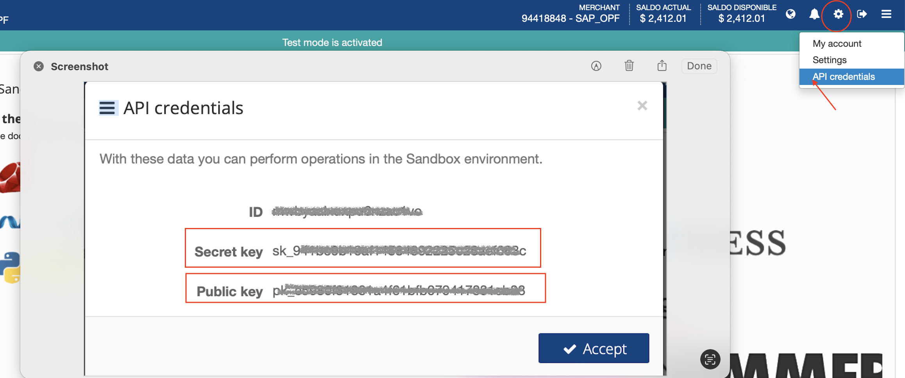
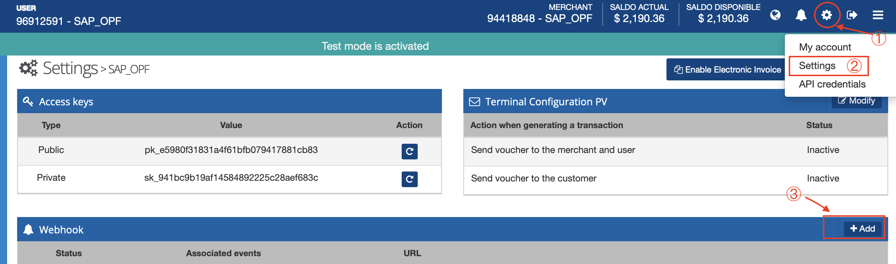
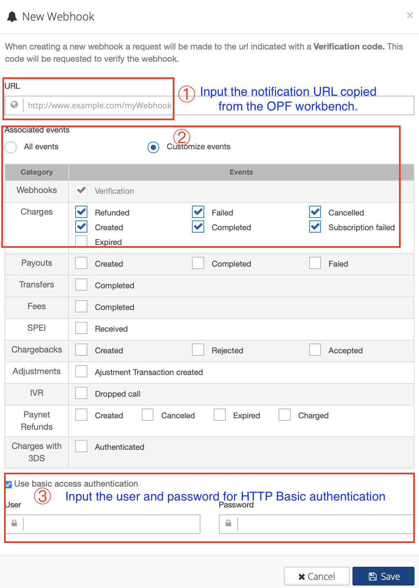
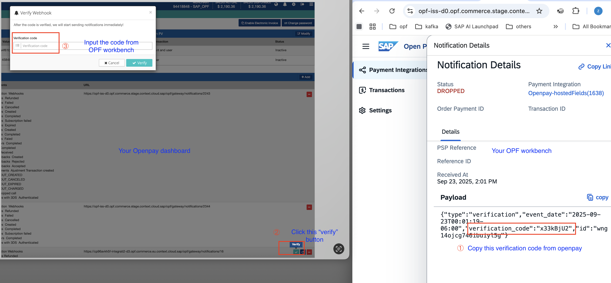

## Introduction

The Postman Collection enables a [Openpay payment button](https://documents.openpay.mx/docs/boton-de-pago.html)  Solution to be used to take payments through OPF. 

The integration supports:

* Authorization with manual capture
* Refund
* Capture

## Setup Instructions

### Overview
To import the [Openpay Payment Button Solution](mapping_configuration.json) this page will take you through the following steps:

a) Create your Openpay Account

b) Create a payment integration in OPF workbench.

c) Prepare the [Postman Environment](environment_configuration.json) file so the collection can be imported with all your OPF Tenant and Openpay Demo Account unique values. 

d) Activate the webhook function in the Openpay dashboard.

e) Allowlist in OPF workbench.

### Create your Openpay Account
 
You can create a free sandbox account at <https://sandbox-dashboard.openpay.mx/login/register?isCandidateForNewStyles=false>

More details you can find in [here](https://documents.openpay.mx/docs/introduction.html)

### Create Payment Integration
Create a new integration in the OPF workbench and set the Merchant ID. For reference, see [Creating Payment Integration](https://help.sap.com/docs/OPEN_PAYMENT_FRAMEWORK/3580ff1b17144b8780c055bbb7c2bed3/20a64f954df1425391757759011e7e6b.html).

**Note**

In step 6, you need :

a) Select ``Immediate Capture`` as the Capture Method since ``Payment Button`` solution only support auto capture.

b) Set the Merchant ID value to the one from your Openpay dashboard.

### Prepare the Postman environment_configuration file

**1. Token**

Get your access token by [creating an external app](https://help.sap.com/docs/OPEN_PAYMENT_FRAMEWORK/8ccca5bb539a49258e924b467ee4e1c2/d927d21974fe4b368e063f72733bf0fe.html) and [making authorized API calls](https://help.sap.com/docs/OPEN_PAYMENT_FRAMEWORK/8ccca5bb539a49258e924b467ee4e1c2/40c792e66e2942209dc853a43533d78d.html).

Copy the value of the access_token field (it’s a JWT) and set as the ``token`` value in the environment file.

IMPORTANT: Ensure the value is prefixed with **Bearer**. e.g. ``Bearer {{token}}``.

**2. Root url**

The ``rootUrl`` is the **BASE URL** of your OPF tenant.

E.g. if your workbench/OPF cockpit url was this …

<https://opf-iss-d0.uis.commerce.stage.context.cloud.sap/opf-workbench>.

The base Url would be

https://opf-iss-d0.uis.commerce.stage.context.cloud.sap.

**3. Integration ID and Configuration ID**

The ``integrationId`` and ``configurationId`` values identify the payment integration and payment configuration, which can be found in the top left of your **Configuration Details** page in the OPF workbench.

* ``integrationId`` maps to ``accountGroupId`` in postman
* ``configurationId`` maps to ``accountId`` in postman

**4. API Credentials**

To make requests to the Openpay API, it is necessary to send the secret key in all your calls to Openpay servers. You can get the key from the [dashboard](https://sandbox-dashboard.openpay.mx/login).

* Copy the ``Secret key`` value to ``authentication_outbound_basic_auth_username_export_707`` in Postman.
* Leave ``authentication_outbound_basic_auth_password_export_707`` in Postman blank for simplicity.

* Copy the ``public key`` value to ``publicKey`` in Postman.

### Activate the webhook function in the Openpay dashboard

To configure a Webhook follow these steps:

1. Go to your Openpay dashboard and click the ``Settings`` button at the top right. In the Webhooks section, select the ``+Add`` option.

2. In the form that appears, indicate the complete notification URL from your OPF Workbench and select the ``charges`` events. You also need to input the username and password for HTTP Basic Authentication.

* Copy the ``User`` value to ``authentication_inbound_basic_auth_username_export_708`` in Postman.
* Copy the ``Password`` value to ``authentication_inbound_basic_auth_password_export_708`` in Postman.

3. Upon completion of the registration configuration, Openpay will send a JSON message to the OPF Workbench, containing a Webhook notification object. You need to copy the code provided in the notification object and verify it in the Openpay dashboard.

### Allowlist
Add the following domains to the domain allowlist in OPF workbench. For instructions, see [Adding Tenant-specific Domain to Allowlist
](https://help.sap.com/docs/OPEN_PAYMENT_FRAMEWORK/3580ff1b17144b8780c055bbb7c2bed3/a6836485b4494cfaad4033b4ee7a9c64.html).

Sandbox: ``sandbox-api.openpay.mx``
Production: ``api.openpay.mx``

### Summary

The environment file is now ready for importing into Postman together with the Mapping Configuration Collection file. Ensure you select the correct environment before running the collection.

In summary, you should have edited the following variables: 

#### Common
- ``token``
- ``rootUrl``
- ``accountGroupId``
- ``accountId``

#### Openpay Specific
- ``publicKey``
- ``authentication_outbound_basic_auth_username_export_707``
- ``authentication_outbound_basic_auth_password_export_707``
- ``authentication_inbound_basic_auth_password_export_708``
- ``authentication_inbound_basic_auth_username_export_708``
  
For sandbox testing, all other values can be left as defaults.  

