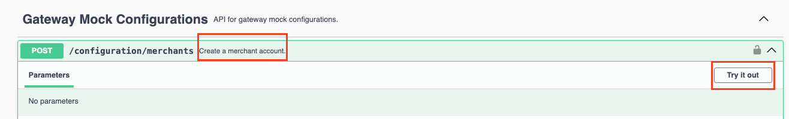
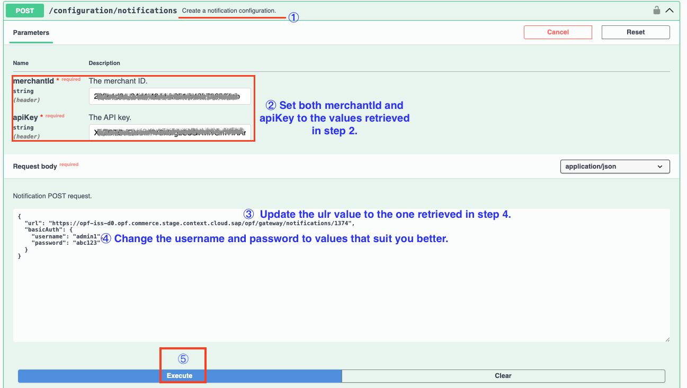

# Introduction
Learn how to integrate a Payment Mock Gateway to open payment framework using Postman collection.

## Procedure
1.	Download both [Postman Environment](PaymentMock%20-%20PAYMENT_PAGE%20-%20PARTIAL_CHARGE%20-%20OPF_Environment_configuration.json) and [Payment Mock Postman Collection](PaymentMock%20-%20PAYMENT_PAGE%20-%20PARTIAL_CHARGE_Provider_configuration.json) files under this folder.
   
2.	Create a Payment Mock integration in the OPF Payment Mock swagger UI. The URL for test environment is: <https://{opf-tenant-id}.opf.commerce.{region}.context.cloud.sap/opf-payment-mock/api/swagger-ui/index.html>. 
   
    a.) Locate the **Create Merchant Account Group** API.
   
    b.) Configure the request body.

    c.) Execute the API call.
  	
   	The following is the response example retrieved:
  	
  	``{
  "merchantId": "2a263ef2-13f2-4561-b05c-ebde41f08d13",
  "apiKey": "uBucbJJSyRhQ93hTdaSkm6M/cfSIWSbI1MD69fFkSWQ=",
  "enableOverCapture": false,
  "overCapturePercentage": 10
  }
``
  	
    d.) Note down the ``merchantId`` and ``apiKey``. They cannot be retrieved again.

3. Create a payment integration for Payment Mock in the open payment framework workbench. For reference, see [Creating Payment Integration
   ](https://help.sap.com/docs/OPEN_PAYMENT_FRAMEWORK/3580ff1b17144b8780c055bbb7c2bed3/20a64f954df1425391757759011e7e6b.html).

4. Under the **General Information** section of the **Integration details** tab, copy the **Notification URL** for later use.

**REMEMBER**
To ensure you receive timely updates on transactions and other important events, this URL is essential for configuring event notifications from Payment Mock.

5. Click **Configure** under the **Configuration** section.

6. Set the Merchant ID of the payment account using the value retrieved in step 2, and select a settlement method for your payment integration.

7. Click **Save**.

8. Note down the ``integrationId`` and the ``configurationId``. These two values identify the payment integration and payment configuration, and can be found in the top left of your **Configuration Details** page.

   **Note**:
   * ``integrationId`` maps to ``accountGroupId`` in Postman
   * ``configurationId`` maps to ``accountId`` in Postman
   
9. Add ``stage.context.cloud.sap`` to the domain allowlist in OPF workbench. For instructions, see [Adding Tenant-specific Domain to Allowlist
](https://help.sap.com/docs/OPEN_PAYMENT_FRAMEWORK/3580ff1b17144b8780c055bbb7c2bed3/a6836485b4494cfaad4033b4ee7a9c64.html).

10. Set notification URL in the Payment Mock Swagger UI.

    a.) Locate the **Create a notification configuration** API.

    b.) Fill the request parameters ``merchantId`` and ``apiKey`` use the value retrieved in step 2.

    c.) Set the url in the request body noted down in step 4.

    d.) Execute the API call and note down the username and password.

11. Edit the Postman Collection variables in the Postman App.

   a.) Import the two files at the same time to Postman.

   b.) Make sure to select the environment for Mock Gateway.

   c.) Edit the Postman environment file so the collection can be imported with all your OPF Tenant and Payment Mock Gateway Test Account unique values.
   
| Name                                                                                 | Description                                                                                                                                                                                                                                                                                                                                                                                                              
| ------------------------------------------------------------------------------------ |--------------------------------------------------------------------------------------------------------------------------------------------------------------------------------------------------------------------------------------------------------------------------------------------------------------------------------------------------------------------------------------------------------------------------|
| token                                                                                | Get your access token by [creating an external app](https://help.sap.com/docs/OPEN_PAYMENT_FRAMEWORK/8ccca5bb539a49258e924b467ee4e1c2/d927d21974fe4b368e063f72733bf0fe.html) and [making authorized API calls](https://help.sap.com/docs/OPEN_PAYMENT_FRAMEWORK/8ccca5bb539a49258e924b467ee4e1c2/40c792e66e2942209dc853a43533d78d.html). **IMPORTANT**: Ensure the value is prefixed with Bearer. e.g. Bearer {{token}}. |                  
| rootURL                                                                              | The ``rootUrl`` is the ``BASE URL`` of your OPF tenant.  E.g. if your workbench/OPF cockpit url was this … https://opf-iss-d0.uis.commerce.stage.context.cloud.sap/opf-workbench. The base Url would be: https://opf-iss-d0.uis.commerce.stage.context.cloud.sap.                                                                                                                                                        | 
| service                                                                              | The ``service`` is the name of your OPF service in specific environment. The value is ``opf`` by default.                                                                                                                                                                                                                                                                                                                |                 
| accountGroupId                                                                      | Refers to The ``integrationId`` value that identifies the payment integration, which can be found in the top left of your configuration details page.                                                                                                                                                                                                                                                                    |                  
| accountId	                                                                    | Refers to the ``configurationId`` value that identifies the payment confguration, which can be found in the top left of your configuration details page.                                                                                                                                                                                                                                                                 |                                                                       
| authentication_inbound_basic_auth_username                                           | ``username`` noted down in step 10.                                                                                                                                                                                                                                                                                                                                                                                      |                  
| authentication_inbound_basic_auth_password                                           | ``password`` noted down in step 10.                                                                                                                                                                                                                                                                                                                                                                                      |                  
| capturePattern                                                                       | ``CAPTURE_PER_SHIPMENT``                                                                                                                                                                                                                                                                                                                                                                                                 |                  
| supportOverCapture                                                                   | ``true``                                                                                                                                                                                                                                                                                                                                                                                                                 |                  
| enableOverCapture                                                                    | ``true``                                                                                                                                                                                                                                                                                                                                                                                                                 |                  
| authorizationTimeoutDays                                                             | 7                                                                                                                                                                                                                                                                                                                                                                                                                        |                  
| apiKey                                                                               | The ``apiKey`` noted down in step 2.                                                                                                                                                                                                                                                                                                                                                                                     |                  
| host                                                                                 | The base URL of your tenant account in OPF payment mock service.                                                                                                                                                                                                                                                                                                                                                         |                  
              
12. Save and run the Postman Collection.

13. Validate the configuration in OPF workbench

     a.) Log in to the OPF workbench.
   
     b.) Click **Payment Integrations** in the left navigation bar.
   
     c.) Navigate to **Payment Integrations** -> **(your Payment Mock integration)** -> **Integration Details**.
   
     d.) In the **Configuration section**, click **Show Details** to go to the configuration details page.
   
     e.) In the **Settlement Method** section, make sure the right option is populated depending on your integration.
   
     f.) In the **Authorization** section, click **Edit** to go to the authorization details page.
   
     g.) In **Authorization** -> **Front-end component configuration**, make sure the Payment Form is the one corresponding to your integration.

      

