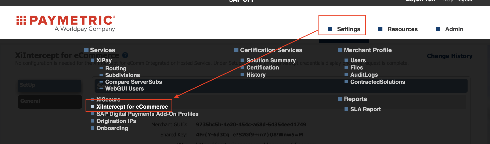
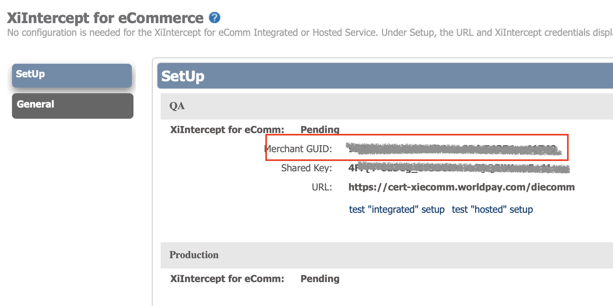
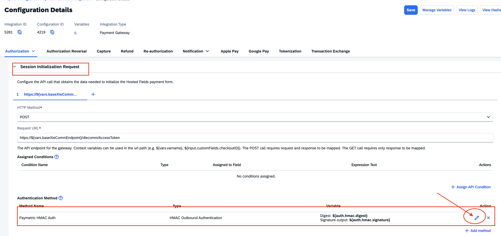
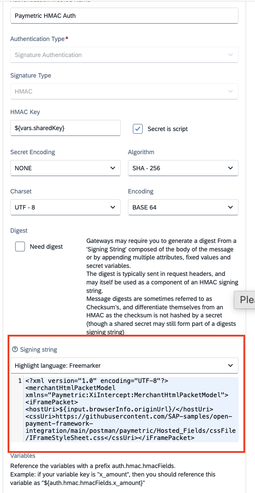

## Introduction

This Postman Collection aids in integrating the ``Intercept_eCommerce_with_XiSecure_Integration`` solution of Paymetric into the Open Payment Framework (OPF).

The integration supports:

* Paymetric token via XiIntercept for eCommerce
* Authorization via XiPay

### In Summary

To import the [Postman Collection](mapping_configuration.json), this page will guide you through the following steps:

a) Sign up for a Paymetric developer account.

b) Create a Paymetric payment integration in OPF.

c) Get the credentials for your Paymetric integration.

d) Prepare the [Postman Environment](environment_configuration.json) file so the collection can be imported with all your OPF Tenant and Paymetric test account unique values.

e) Apply your own Cascading Style Sheet (CSS) to your iFrame.

### Signing Up for a Paymetric Developer Account

Contact the Paymetric support team to obtain your test account, then log in to the [Merchant Portal](https://merchantportal.worldpay.com/Authentication/Login).

### Creating a Paymetric Payment Integration

Create a Paymetric payment integration in the OPF workbench. For reference, see [Creating Payment Integration](https://help.sap.com/docs/OPEN_PAYMENT_FRAMEWORK/3580ff1b17144b8780c055bbb7c2bed3/20a64f954df1425391757759011e7e6b.html).

For Step 6, you can get your Paymetric Merchant ID from the support team, or retrieve it from the [Merchant Portal](https://merchantportal.worldpay.com/Authentication/Login):

Navigate to **Settings** > **XiIntercept for eCommerce**:

Then copy the Merchant GUID to your OPF workbench:

### Get the Credentials for Your Paymetric Integration

Once you have created your test account, contact the Paymetric support team to obtain the following two groups of API credentials:

a) API credentials for Paymetric token:
- ``Merchant GUID``
- ``Shared Key``

b) API credentials for Authorization (XiPay) — Dev cartridge simulator (max auth $1,000):
- ``User``
- ``Password``

### Preparing the Postman Environment Configuration File

**1. Token**

Get your access token by [creating an external app](https://help.sap.com/docs/OPEN_PAYMENT_FRAMEWORK/8ccca5bb539a49258e924b467ee4e1c2/d927d21974fe4b368e063f72733bf0fe.html) and [making authorized API calls](https://help.sap.com/docs/OPEN_PAYMENT_FRAMEWORK/8ccca5bb539a49258e924b467ee4e1c2/40c792e66e2942209dc853a43533d78d.html).

Copy the value of the `access_token` field (it's a JWT) and set it as the ``token`` value in the environment file.

**IMPORTANT**: Ensure the value is prefixed with **Bearer**. e.g. ``Bearer {{token}}``.

**2. Root URL**

The ``rootUrl`` is the **BASE URL** of your OPF tenant.

For example, if your workbench/OPF cockpit URL is:

<https://opf-iss-d0.uis.commerce.stage.context.cloud.sap/opf-workbench>

The base URL would be:

https://opf-iss-d0.uis.commerce.stage.context.cloud.sap

**3. Integration ID and Configuration ID**

The ``integrationId`` and ``configurationId`` values identify the payment integration and payment configuration, which can be found in the top left of your **Configuration Details** page in the OPF workbench.

* ``integrationId`` maps to ``accountGroupId`` in Postman
* ``configurationId`` maps to ``accountId`` in Postman

**4. sharedKey**

Copy the ``Shared Key`` provided by the Paymetric support team. It is used for the Paymetric token-related API calls.

**5. baseXieCommEndpoint**

Copy the XiIntercept eCommerce endpoint value for your environment:

* Cert: https://cert-xiecomm.worldpay.com
* Prod: https://xiecomm.worldpay.com

**6. baseXiPayEndpoint**

Copy the XiPay Web Service endpoint value for your environment:

* Cert: https://cert-xipayapi.worldpay.com
* Prod: https://xipayapi.worldpay.com

**7. XiPayUsername and XiPayPassword**

Copy the ``User`` and ``Password`` provided by the Paymetric support team. These are used for the Authorization API calls.

### Apply Your Own CSS to Your iFrame

To render the card input fields with your own styling, you need to provide a CSS server URL in the Packet XML.

A [valid_packet_xml](resource/valid_packet_xml_without_3ds.txt) is provided by the Paymetric support team. Update it and copy the contents to the OPF workbench:

Navigate to **Configuration Details** > **Authorization** > **Session Initialization Request** area, then click the **Edit** button for the Authentication Method:

Replace the entire content of the Signing String field:

**Note**: Ensure the `cssUri` parameter has a valid value, otherwise the CSS will not be applied to your iFrame.

### Allowlist

Add the following domains to the domain allowlist in OPF workbench. For instructions, see [Adding Tenant-specific Domain to Allowlist](https://help.sap.com/docs/OPEN_PAYMENT_FRAMEWORK/3580ff1b17144b8780c055bbb7c2bed3/a6836485b4494cfaad4033b4ee7a9c64.html).

* ``cert-xiecomm.worldpay.com`` for Sandbox
* ``cert-xipayapi.worldpay.com`` for Sandbox
* ``xiecomm.worldpay.com`` for Production
* ``xipayapi.worldpay.com`` for Production

### Summary

The environment file is now ready for importing into Postman together with the Mapping Configuration Collection file. Ensure you select the correct environment before running the collection.

You should have configured the following variables:

#### Common
- ``token``
- ``rootUrl``
- ``accountGroupId``
- ``accountId``

#### Paymetric Specific
- ``XiPayUsername``
- ``XiPayPassword``
- ``baseXiPayEndpoint``
- ``baseXieCommEndpoint``
- ``sharedKey``
