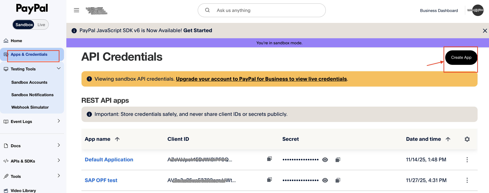
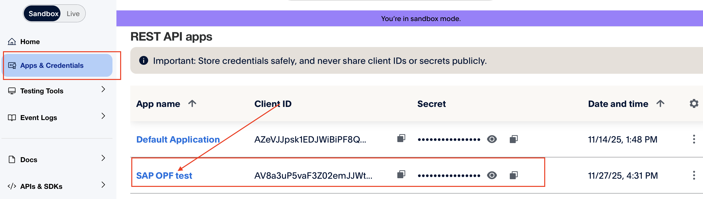
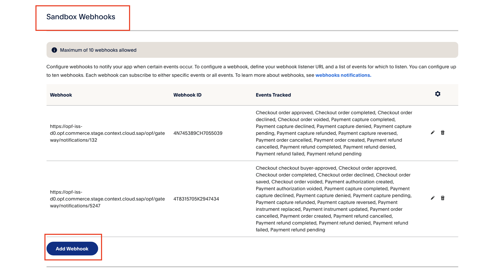

## Introduction ##
This Postman Collection aids in integrating [PayPal checkout](https://developer.paypal.com/api/rest/integration/orders-api/api-use-cases/standard/) into the Open Payment Framework (OPF).

The integration supports:

* Authorize card
* Settlement
* Refund
* Reversal

### In summary ###
In summary, to import the [Postman Collection](mapping_configuration.json), this page will guide you through the following steps:

a) [Sign up for a PayPal developer account](https://www.paypal.com/signin?locale.x=en_US).

b) Create a PayPal payment integration in OPF.

c) Get the credentials for your PayPal integration.

d) Webhook configuration

d) Prepare the [Postman Environment](environment_configuration.json) file so the collection can be imported with all your OPF Tenant and PayPal Test Account unique values. 

### Signing Up a PayPal Developer Account ###
Create your PayPal developer account by visiting [Sign up for a PayPal developer account](https://www.paypal.com/signin?locale.x=en_US).

Once registered, create your business and personal sandbox accounts by following the instructions in this [guide](https://developer.paypal.com/tools/sandbox/accounts/#link-createandmanagesandboxaccounts)

### Creating a PayPal Payment Integration ###
Create a PayPal payment integration in the OPF workbench. For reference, see [Creating Payment Integration
](https://help.sap.com/docs/OPEN_PAYMENT_FRAMEWORK/3580ff1b17144b8780c055bbb7c2bed3/20a64f954df1425391757759011e7e6b.html).

For Step 6, you can define the Merchant ID freely, as there are no restrictions on this field for PayPal integration with OPF.

### Get the credentials for your PayPal integration ###
Once you have created your business test account, follow these steps to obtain your PayPal API credentials:

a) Select Log in to [Dashboard](https://developer.paypal.com/dashboard/) and log in or sign up.
b) Select Apps & Credentials.
c) New accounts come with a Default Application in the REST API apps section. To create a new project, select Create App.
d) Copy the client ID and client secret for your OPF.

### Webhook configuration ###

After creating your app under Apps & Credentials, click on the app and scroll down to the Webhook section. Then click the ``Add Webhook`` button.
Next, you need to:

a) Fetch your webhook URL from the OPF Workbench
b) Select the event types for your integration (recommended event types:  events under ``checkout``and ``Payments & payouts``)
c) Copy the Webhook ID to your OPF configuration after creating the webhook.

### Preparing the Postman environment_configuration file ###

**1. Token**

Get your access token by [creating an external app](https://help.sap.com/docs/OPEN_PAYMENT_FRAMEWORK/8ccca5bb539a49258e924b467ee4e1c2/d927d21974fe4b368e063f72733bf0fe.html) and [making authorized API calls](https://help.sap.com/docs/OPEN_PAYMENT_FRAMEWORK/8ccca5bb539a49258e924b467ee4e1c2/40c792e66e2942209dc853a43533d78d.html).

Copy the value of the access_token field (it’s a JWT) and set as the ``token`` value in the environment file.

**IMPORTANT**: Ensure the value is prefixed with **Bearer**. e.g. ``Bearer {{token}}``.

**2. Root url**

The ``rootUrl`` is the **BASE URL** of your OPF tenant.

E.g. if your workbench/OPF cockpit url was this …

<https://opf-iss-d0.uis.commerce.stage.context.cloud.sap/opf-workbench>.

The base Url would be

https://opf-iss-d0.uis.commerce.stage.context.cloud.sap.

**3. Integration ID and Configuration ID**

The ``integrationId`` and ``configurationId`` values identify the payment integration and payment configuration, which can be found in the top left of your **Configuration Details** page in the OPF workbench.

* ``integrationId`` maps to ``accountGroupId`` in Postman
* ``configurationId`` maps to ``accountId`` in Postman

**4. apiKey and  apiSecret**

Retrieve the stored ``apiKey`` and ``apiSecret`` that you configured during the [API key/secret pair configuration](#get-the-credentials-for-your-paypal-integration-) step.

``authentication_outbound_oauth2_token_url_export_1028`` :https://api-m.sandbox.paypal.com/v1/oauth2/token
``authentication_outbound_oauth2_client_id_export_1028`` : Copy the Client Id from your PayPal API credentials
``authentication_outbound_oauth2_client_secret_export_1028`` : Copy the Secret key 1 from your PayPal API credentials
``authentication_outbound_oauth2_use_basic_auth_export_1028`` : Keep the default value as true since this uses Basic Authentication

**5. webhookId**

Retrieve the stored ``webhookId`` that you configured during the [Webhook configuration step](#webhook-configuration-).

### Allowlist
Add the following domains to the domain allowlist in OPF workbench. For instructions, see [Adding Tenant-specific Domain to Allowlist
](https://help.sap.com/docs/OPEN_PAYMENT_FRAMEWORK/3580ff1b17144b8780c055bbb7c2bed3/a6836485b4494cfaad4033b4ee7a9c64.html).

``api-m.paypal.com`` for production
``api-m.sandbox.paypal.com`` for testSandbox.

### Summary

The environment file is now ready for importing into Postman together with the Mapping Configuration Collection file. Ensure you select the correct environment before running the collection.

In summary, you should have edited the following variables: 

#### Common
- ``token``
- ``rootUrl``
- ``accountGroupId``
- ``accountId`` 

#### PayPal Specific
- ``authentication_outbound_oauth2_token_url_export_1028``
- ``authentication_outbound_oauth2_client_id_export_1028``
- ``authentication_outbound_oauth2_client_secret_export_1028`` 
- ``webhookId`` 
