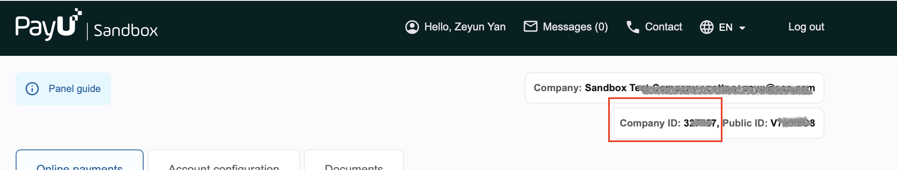
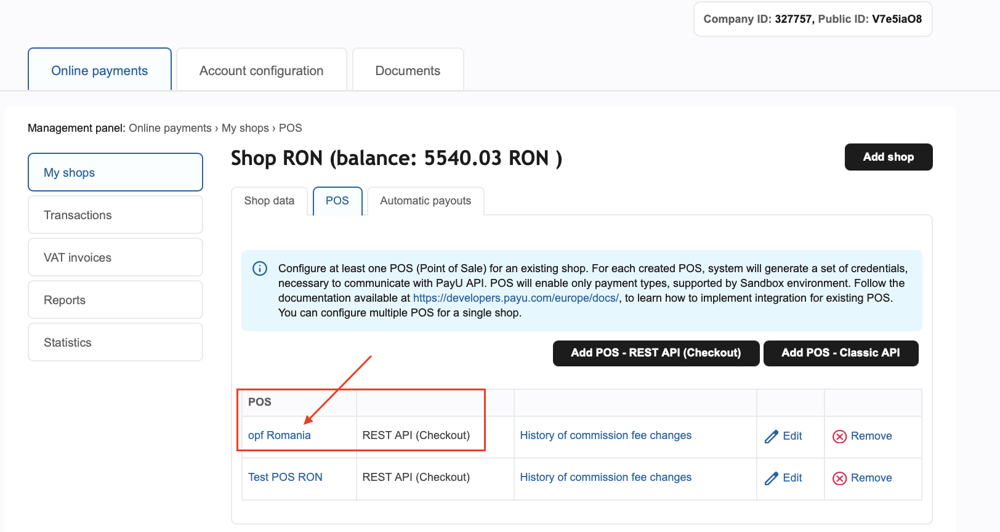
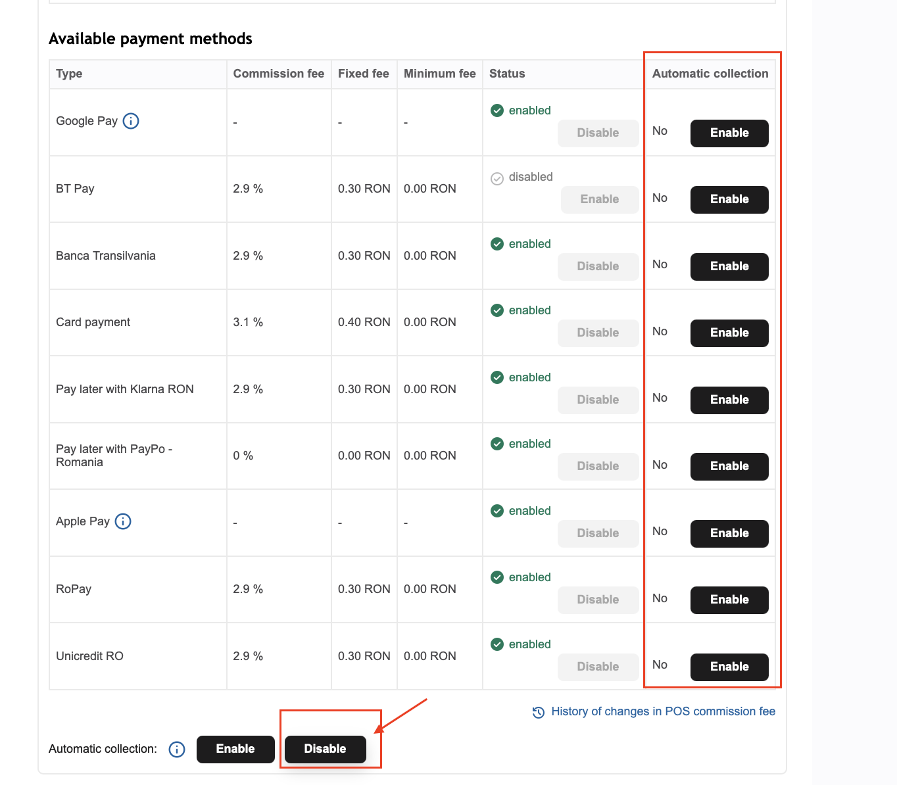
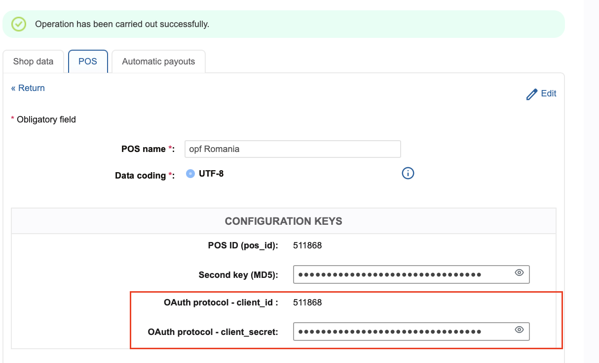
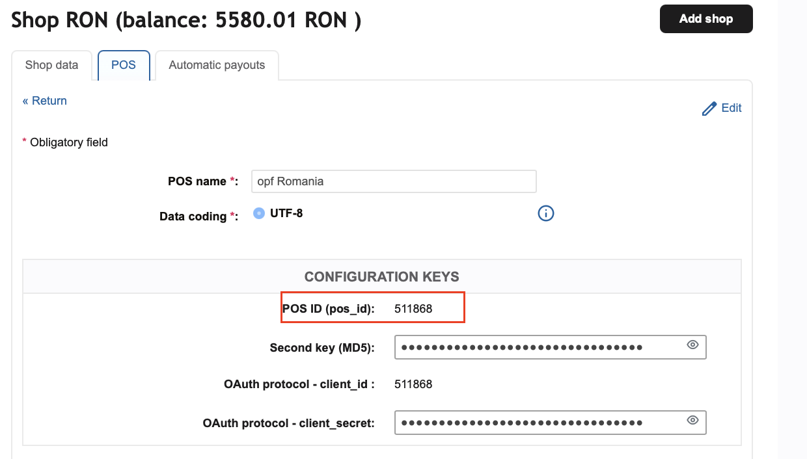
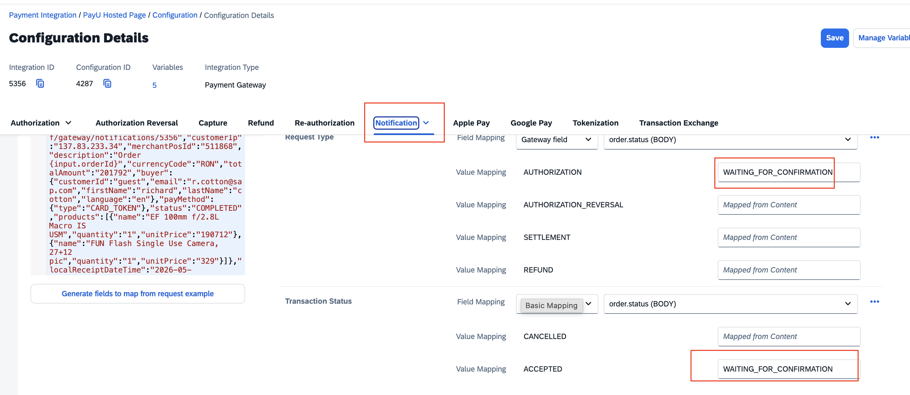

## Introduction 
This Postman Collection aids in integrating [PayU Europe Payment Page](https://developers.payu.com/europe/docs/get-started/integration-overview/accept-payment/#example) into the Open Payment Framework (OPF).

The integration supports:

* Authorize card
* Settlement
* Refund
* Reversal

### In summary 
In summary, to import the [Postman Collection](mapping_configuration.json), this page will guide you through the following steps:

a) [Create your PayU Europe test account](https://registration-merch-prod.snd.payu.com/boarding/#/registerSandbox/).

b) Create a PayU Europe integration in OPF.

c) Get the credentials for your PayU Europe integration.

d) Prepare the [Postman Environment](environment_configuration.json) file so the collection can be imported with all your OPF Tenant and PayU Europe Test Account unique values. 

f) Update Configuration for ``Immediate Capture``

g) 

### Creating a PayU Europe Account 
You can sign up for a free PayU Europe test account by following this document [Registering with PayU](https://developers.payu.com/europe/docs/get-started/set-up-account/register/).

Once registered, you can log in to your Sandbox [Merchant Panel ](https://merch-prod.snd.payu.com/user/login).

For more information about the Merchant Panel and its features, see this [documentation](https://developers.payu.com/europe/docs/get-started/set-up-account/management-panel/)

### Creating a PayU Europe Payment Integration 
Create a PayU Europe  payment integration in the OPF workbench. For reference, see [Creating Payment Integration
](https://help.sap.com/docs/OPEN_PAYMENT_FRAMEWORK/3580ff1b17144b8780c055bbb7c2bed3/20a64f954df1425391757759011e7e6b.html).

For step 6:
a) The suggestion value of Merchant ID is the PSP ID, You can found it in your [Merchant Panel](https://merch-prod.snd.payu.com/user/login).

b) For the capture method, if you don't want Immediate Capture in OPF, you must disable auto-receive on your POS in the PayU Europe Merchant Panel:

Go to ``Online payments`` > ``My shops`` >`` POS`` tab, and click on the POS name corresponding to the item you want to use.

At the bottom of the ``Available payment methods`` section, you will find the ``Automatic collection``toggle. Click the ``Disable`` button to disable automatic collection for all payment methods simultaneously.

### Get the credentials for your PayU Europe  integration 
Authentication involves generating an OAuth token, which is used for further communication with PayU servers. To create a standard OAuth token, you will need the `client_id` and `client_secret` keys, which can be found in your merchant panel.

To retrieve your credentials:
Go to **Online payments** > **My shops** > **POS** tab, click on your POS name, and you will find the ``client_id`` and ``client_secret`` keys.

### Preparing the Postman environment_configuration file 

**1. Token**

Get your access token by [creating an external app](https://help.sap.com/docs/OPEN_PAYMENT_FRAMEWORK/8ccca5bb539a49258e924b467ee4e1c2/d927d21974fe4b368e063f72733bf0fe.html) and [making authorized API calls](https://help.sap.com/docs/OPEN_PAYMENT_FRAMEWORK/8ccca5bb539a49258e924b467ee4e1c2/40c792e66e2942209dc853a43533d78d.html).

Copy the value of the access_token field (it’s a JWT) and set as the ``token`` value in the environment file.

**IMPORTANT**: Ensure the value is prefixed with **Bearer**. e.g. ``Bearer {{token}}``.

**2. Root url**

The ``rootUrl`` is the **BASE URL** of your OPF tenant.

E.g. if your workbench/OPF cockpit url was this …

<https://opf-iss-d0.uis.commerce.stage.context.cloud.sap/opf-workbench>.

The base Url would be

https://opf-iss-d0.uis.commerce.stage.context.cloud.sap.

**3. Integration ID and Configuration ID**

The ``integrationId`` and ``configurationId`` values identify the payment integration and payment configuration, which can be found in the top left of your **Configuration Details** page in the OPF workbench.

* ``integrationId`` maps to ``accountGroupId`` in Postman
* ``configurationId`` maps to ``accountId`` in Postman

**4. apiKey and  apiSecret**

Obtain your ``apiKey`` and ``apiSecret`` during the [Get the credentials for your PayU Europe  integration](#get-the-credentials-for-your-payu-europe--integration-) step.

**5. capturePattern**
values can be : ``AUTO_CAPTURE``, ``CAPTURE_PER_SHIPMENT``, ``PARTIAL_CAPTURE``

**6. posId**
Retrieve your POS ID from your  [Merchant Panel](https://merch-prod.snd.payu.com/user/login).

**7. refundType**
The following refund types are available:
``REFUND_PAYMENT_STANDARD`` – Standard refund procedure
``FAST`` – Expedited refund process with potentially higher fees. Available only to merchants operating through PayU GPO Romania

### Allowlist
Add the following domains to the domain allowlist in OPF workbench. For instructions, see [Adding Tenant-specific Domain to Allowlist
](https://help.sap.com/docs/OPEN_PAYMENT_FRAMEWORK/3580ff1b17144b8780c055bbb7c2bed3/a6836485b4494cfaad4033b4ee7a9c64.html).

``secure.payu.com`` for Production
``secure.snd.payu.com`` for Sandbox test

### Update Configuration for Immediate Capture
If you are using the ``Immediate Capture`` configuration, you must update your Notification configuration after importing the Postman collection into your workbench.

**Steps:**
1. Navigate to the **Notification** tab
2. Update both **Request Type** and **Transaction Status** values from ``WAITING_FOR_CONFIRMATION`` to ``COMPLETED``

### Summary

The environment file is now ready for importing into Postman together with the Mapping Configuration Collection file. Ensure you select the correct environment before running the collection.

In summary, you should have edited the following variables: 

#### Common
- ``token``
- ``rootUrl``
- ``accountGroupId``
- ``accountId`` 

#### PayU Europe Specific
- ``apiKey``
- ``apiSecret``
- ``webhookSecret`` 
  
