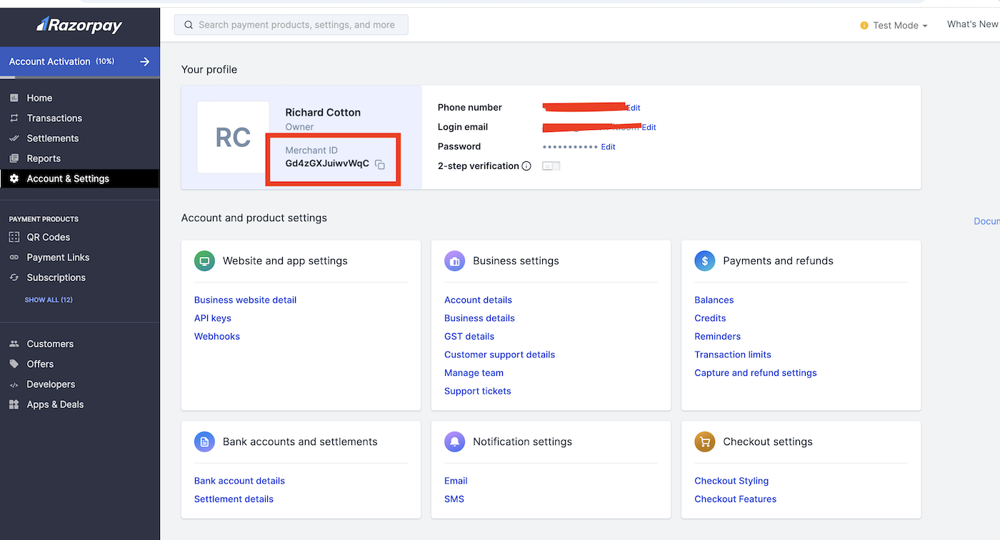
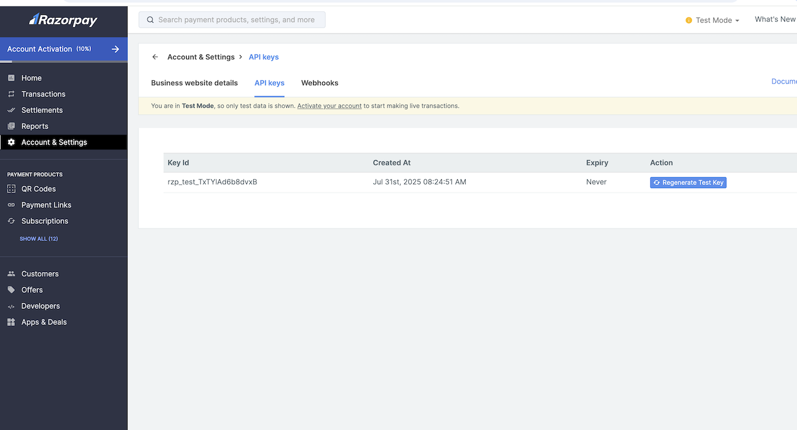
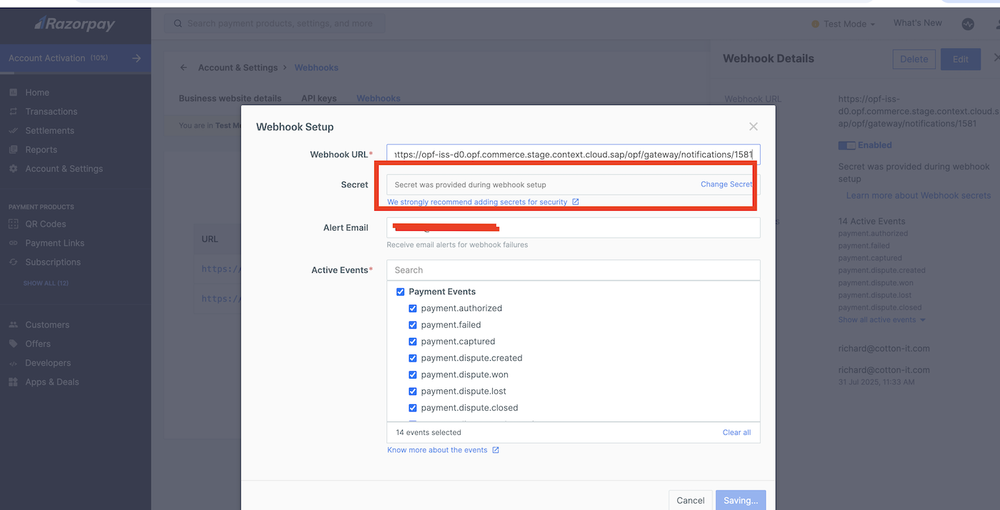

## Introduction

The Postman Collection enables a [Razorpay Web Checkout](https://razorpay.com/docs/payments/payment-gateway/web-integration/standard/) Payment Form to be used to take payments through OPF. 

The integration supports:

* Authorization with manual or auto capture
* Settlements
* Refunds

The integration does not support
* Authorization reversal (not supported)
* Reauthorization (not available)

Roadmap:
* Testing of payment methods beyond card (e.g. UPI)

## Setup Instructions

### Overview
To import the [Razorpay Web Checkout](mapping_configuration.json) this page will take you through the following steps:

a) Create your Razorpay Account

b) Create a payment integration in OPF workbench.

c) Prepare the [Postman Environment](environment_configuration.json) file so the collection can be imported with all your OPF Tenant and Razorpay Demo Account unique values. 

### Create your Razorpay Account

A Individual or business account can be created through the [signup](https://dashboard.razorpay.com/signup) process.

### Creating Payment Integration
Create a new integration in the OPF workbench and set the Merchant ID. For reference, see [Creating Payment Integration](https://help.sap.com/docs/OPEN_PAYMENT_FRAMEWORK/3580ff1b17144b8780c055bbb7c2bed3/20a64f954df1425391757759011e7e6b.html).

**Note**

In step 6, you can specify a unique Merchant ID name which is obtainable from the [account section of the dashboard](https://dashboard.razorpay.com/app/account-settings).

### Preparing the Postman environment_configuration file

**1. Token**

Get your access token by [creating an external app](https://help.sap.com/docs/OPEN_PAYMENT_FRAMEWORK/8ccca5bb539a49258e924b467ee4e1c2/d927d21974fe4b368e063f72733bf0fe.html) and [making authorized API calls](https://help.sap.com/docs/OPEN_PAYMENT_FRAMEWORK/8ccca5bb539a49258e924b467ee4e1c2/40c792e66e2942209dc853a43533d78d.html).

Copy the value of the access_token field (it’s a JWT) and set as the ``token`` value in the environment file.

IMPORTANT: Ensure the value is prefixed with **Bearer**. e.g. ``Bearer {{token}}``.

**2. Root url**

The ``rootUrl`` is the **BASE URL** of your OPF tenant.

E.g. if your workbench/OPF cockpit url was this …

<https://opf-iss-d0.uis.commerce.stage.context.cloud.sap/opf-workbench>.

The base Url would be

https://opf-iss-d0.uis.commerce.stage.context.cloud.sap.

**3. Integration ID and Configuration ID**

The ``integrationId`` and ``configurationId`` values identify the payment integration and payment configuration, which can be found in the top left of your **Configuration Details** page in the OPF workbench.

* ``integrationId`` maps to ``accountGroupId`` in postman
* ``configurationId`` maps to ``accountId`` in postman

**4. API Credentials**

The RazorPay API operates using a key id and secret value, and each set of keys are unique for each account and environment (sandbox or production) and must be retrieved from the [dashboard](https://dashboard.razorpay.com/app/website-app-settings/api-keys)

Then you can find both keys:

* ``Key ID`` maps to ``apiKeyId`` and ``authentication_outbound_basic_auth_username_export_599`` in postman
* ``Secret`` maps to ``authentication_outbound_basic_auth_password_export_599`` in postman

**5. webhookSecret**

IN OPF Workbench: For your new Razorpay payment integration, navigate to the General Information section of the Integration details tab to copy the Notification URL.

Create a new webhook endpoint in the Razorpay [dashboard](https://dashboard.razorpay.com/app/website-app-settings/webhooks), inputting the OPF notification URL and activate at least ``payment.authorized``, ``payment.failed``, ``payment.captured``, ``refund.processed``, ``refund.failed`` events. 

Decide a suitably secure secret and input into the dashboard and the postman environment value.

 

**6. paymentFormLogo**

You can configure an image link to display in the Razorpay payment form.

**7. paymentFormMerchantName**

The name of the merchant you want to appear in the Razorpay payment form

**8. payButtonLabel**

The label to appear on the payment button in checkout.

### Allowlist
Add the following domains to the domain allowlist in OPF workbench. For instructions, see [Adding Tenant-specific Domain to Allowlist
](https://help.sap.com/docs/OPEN_PAYMENT_FRAMEWORK/3580ff1b17144b8780c055bbb7c2bed3/a6836485b4494cfaad4033b4ee7a9c64.html).

``api.razorpay.com``

### Summary

The environment file is now ready for importing into Postman together with the Mapping Configuration Collection file. Ensure you select the correct environment before running the collection.

In summary, you should have edited the following variables: 

#### Common
- ``token``
- ``rootUrl``
- ``accountGroupId``
- ``accountId``

#### Razorpay Specific
- ``apiKeyId``
- ``authentication_outbound_basic_auth_username_export_599``
- ``authentication_outbound_basic_auth_password_export_599``
- ``paymentFormLogo``
- ``paymentFormMerchantName``
- ``payButtonLabel``
- ``webhookSecret``
  
For sandbox testing, all other values can be left as defaults.  

