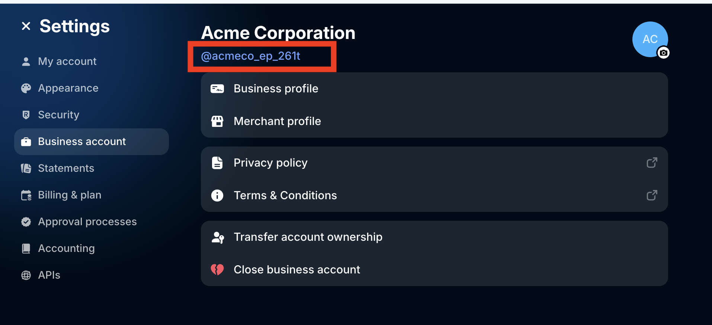
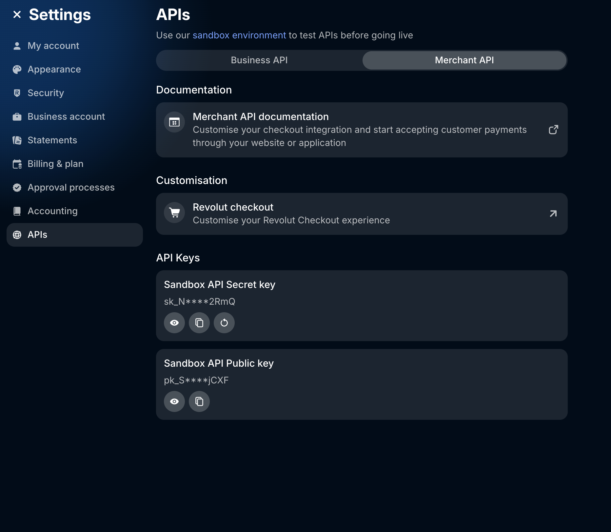

## Introduction

The Postman Collection enables a [Revolut Hosted Checkout Page](https://developer.revolut.com/docs/guides/accept-payments/online-payments/hosted-checkout-page/introduction) Payment Form to be used to take payments through OPF. 

The integration supports:

* Authorization with delayed capture
* Settlements
* Refunds
* Authorization Reversal

Roadmap:
* Reauthorization
* Passing tracking info at Capture

## Setup Instructions

### Overview
To import the [Revolut Hosted Checkout](Revolut-mapping_configuration.json) this page will take you through the following steps:

a) Create your Revolut Merchant API Account

b) Create a payment integration in OPF workbench.

c) Prepare the [Postman Environment](Revolut-environment_configuration.json) file so the collection can be imported with all your OPF Tenant and Revolut Sandbox Account unique values. 

### Create your Revolut Account

A sandbox account can be created as per [sandbox sign up instructions](https://developer.revolut.com/docs/guides/accept-payments/get-started/set-up-sandbox) .

### Creating Payment Integration
Create a new integration in the OPF workbench and set the Merchant ID. For reference, see [Creating Payment Integration](https://help.sap.com/docs/OPEN_PAYMENT_FRAMEWORK/3580ff1b17144b8780c055bbb7c2bed3/20a64f954df1425391757759011e7e6b.html).

**Note**

In step 6, you can specify a unique Merchant ID name which is obtainable from the [business account section of the dashboard](https://sandbox-business.revolut.com/settings/business-account).

### Preparing the Postman environment_configuration file

**1. Token**

Get your access token by [creating an external app](https://help.sap.com/docs/OPEN_PAYMENT_FRAMEWORK/8ccca5bb539a49258e924b467ee4e1c2/d927d21974fe4b368e063f72733bf0fe.html) and [making authorized API calls](https://help.sap.com/docs/OPEN_PAYMENT_FRAMEWORK/8ccca5bb539a49258e924b467ee4e1c2/40c792e66e2942209dc853a43533d78d.html).

Copy the value of the access_token field (it’s a JWT) and set as the ``token`` value in the environment file.

IMPORTANT: Ensure the value is prefixed with **Bearer**. e.g. ``Bearer {{token}}``.

**2. Root url**

The ``rootUrl`` is the **BASE URL** of your OPF tenant.

E.g. if your workbench/OPF cockpit url was this …

<https://opf-iss-d0.uis.commerce.stage.context.cloud.sap/opf-workbench>.

The base Url would be

https://opf-iss-d0.uis.commerce.stage.context.cloud.sap.

**3. Integration ID and Configuration ID**

The ``integrationId`` and ``configurationId`` values identify the payment integration and payment configuration, which can be found in the top left of your **Configuration Details** page in the OPF workbench.

* ``integrationId`` maps to ``accountGroupId`` in postman
* ``configurationId`` maps to ``accountId`` in postman

**4. API Credentials**

The Revolut Merchant API requires a public and secret key to be generated as per [the following instructions](https://developer.revolut.com/docs/guides/accept-payments/get-started/generate-the-api-key). They are located in the Settings -> API.

* ``secretKey``
* ``publicKey``

**5. webhookSecret**

IN OPF Workbench: For your new Revolut payment integration, navigate to the General Information section of the Integration details tab to copy the Notification URL.

You will need to create the webhook though an API call using the secret key from step 4. Here is an example curl request. 

``curl --location 'https://sandbox-merchant.revolut.com/api/1.0/webhooks' \
--header 'Content-Type: application/json' \
--header 'Accept: application/json' \
--header 'Authorization: Bearer sk_*******' \
--data '{
  "url": "__NOTIFICATION_URL__",
  "events": [
    "ORDER_COMPLETED",
    "ORDER_AUTHORISED",
    "ORDER_CANCELLED",
    "ORDER_FAILED",
    "ORDER_PAYMENT_DECLINED"
  ]
}'``
 
On successful creation copy the generated secret into the ``signingSecret`` variable.

### Allowlist
Add the following domains to the domain allowlist in OPF workbench. For instructions, see [Adding Tenant-specific Domain to Allowlist
](https://help.sap.com/docs/OPEN_PAYMENT_FRAMEWORK/3580ff1b17144b8780c055bbb7c2bed3/a6836485b4494cfaad4033b4ee7a9c64.html).

``merchant.revolut.com``
``sandbox-merchant.revolut.com``

### Summary

The environment file is now ready for importing into Postman together with the Mapping Configuration Collection file. Ensure you select the correct environment before running the collection.

In summary, you should have edited the following variables: 

#### Common
- ``token``
- ``rootUrl``
- ``accountGroupId``
- ``accountId``

#### Revolut Specific
- ``secretKey``
- ``publicKey``
- ``signingSecret``

  
For sandbox testing, all other values can be left as defaults.  

