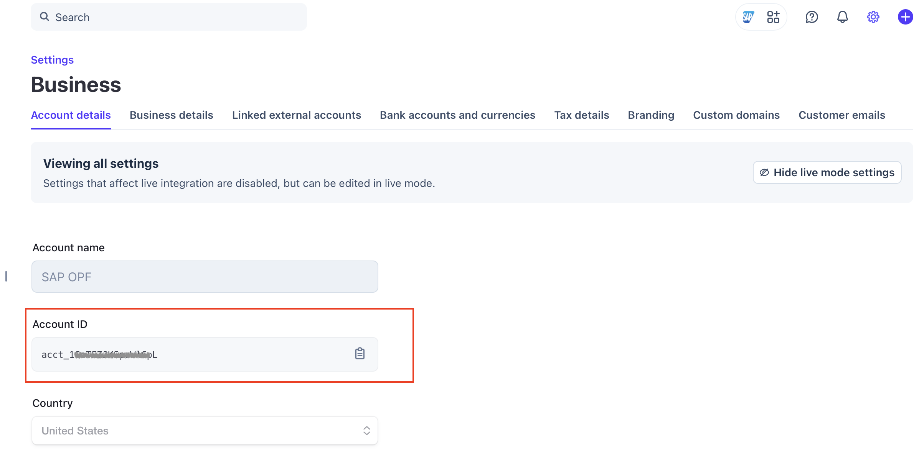
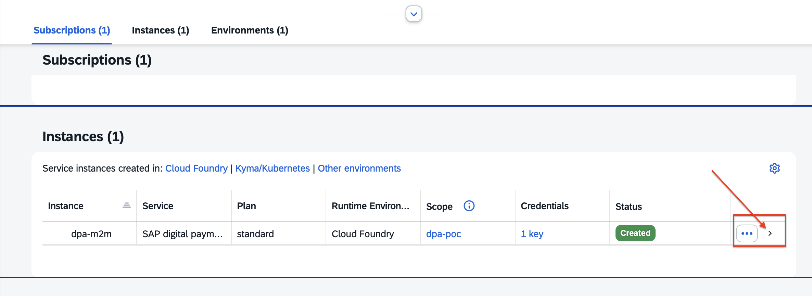
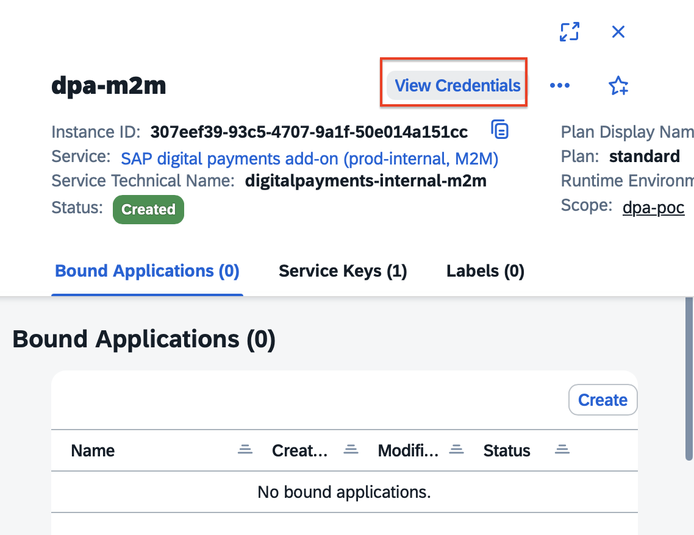
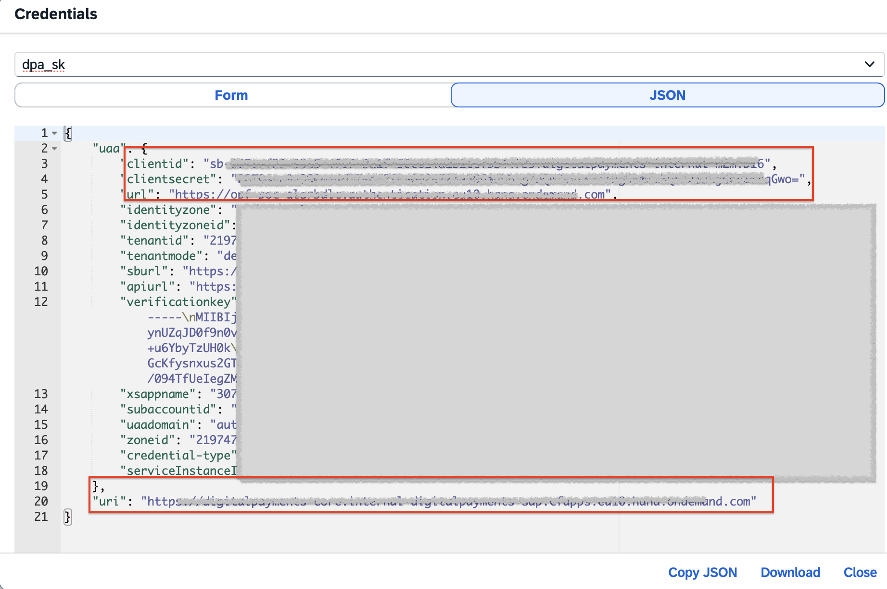
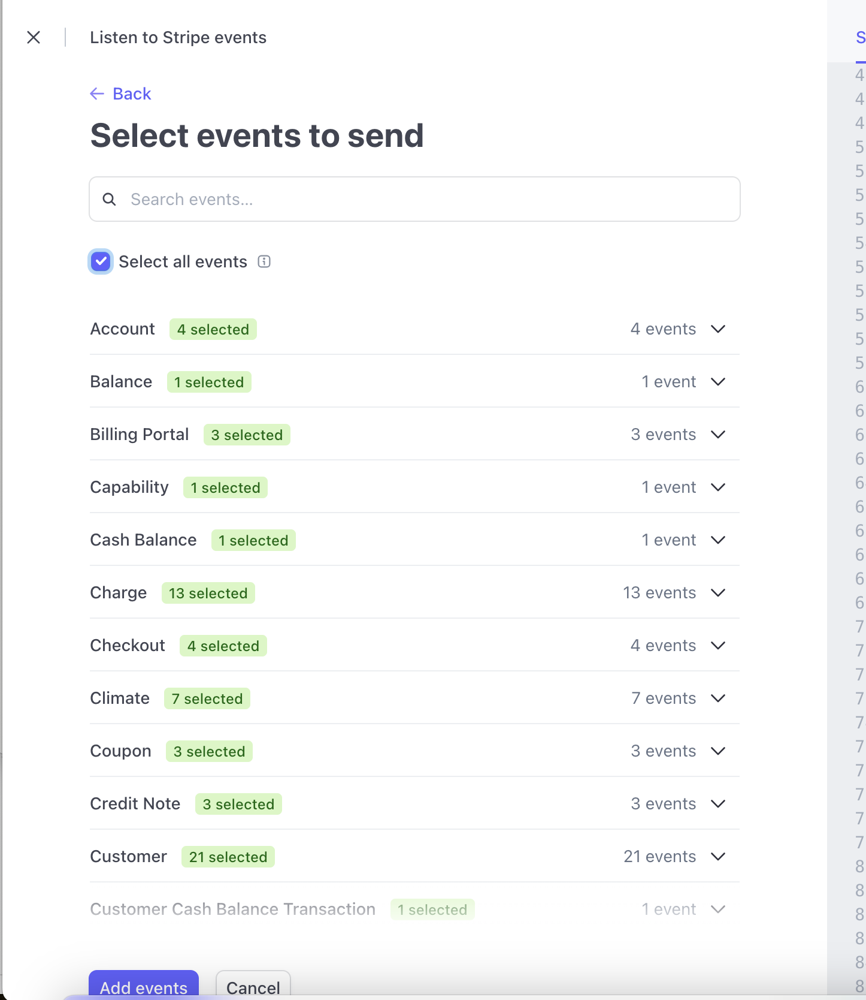
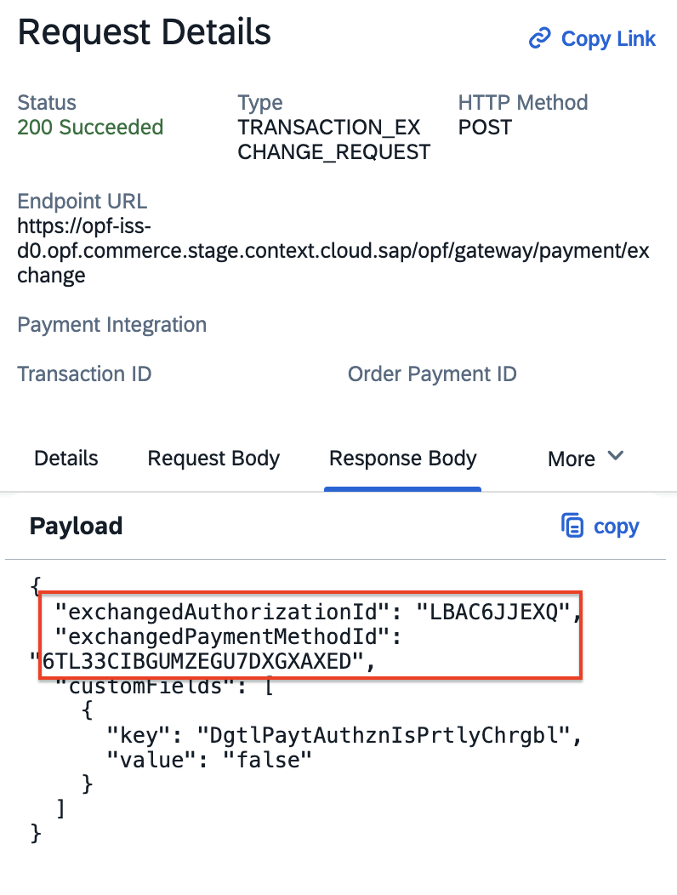

## Introduction

This is a combined Postman Collection that provides a [Stripe Payment Elements Form](https://docs.stripe.com/payments/payment-element?locale=en-GB) integration for authorization processing through the Open Payment Framework (OPF).
OPF registers the authorization in DPA, which then handles all follow-up processes using that authorization.

The integration supports:

* Authorization of payments using PCI SAQ-A Stripe Payment Elements with the OPF "Hosted Fields" UX pattern
* Authorization with a saved card

## Setup Instructions

### Summary

To import the [Postman Collection](mapping_configuration.json), this page will guide you through the following steps:

a) Create your Stripe test account.

b) Create a Stripe payment integration in the OPF workbench.

c) Retrieve your DPA credentials.

d) Prepare the [Postman Environment](environment_configuration.json) file so the collection can be imported with all your OPF tenant and Stripe test account values.

### Creating a Stripe Account

You can sign up for a free Stripe test account at https://dashboard.stripe.com/register.

### Creating a Stripe Payment Integration

Create a Stripe payment integration in the OPF workbench. For reference, see [Creating Payment Integration](https://help.sap.com/docs/OPEN_PAYMENT_FRAMEWORK/3580ff1b17144b8780c055bbb7c2bed3/20a64f954df1425391757759011e7e6b.html).

For Step 6, you can retrieve the merchant ID from the Stripe Dashboard via **Settings → Account settings → Business**.

### Retrieve Your DPA Credentials

Retrieve the API credentials from your DPA account. If you do not have a DPA account, follow the [Administration Guide for SAP Digital Payments Add-on](https://help.sap.com/docs/DIGITALPAYMENTS/a5c364402f8d4c0b99f6a4c7de385a56/1dedbb58ac1747dea8d768d971c1e484.html) to create one.

Navigate to **Instances and Subscriptions** and find the M2M service under your instance:

Click the arrow to open the details page:

Click the **View Credentials** button. A pop-up window will display the credential details:

Copy and store these four values (`clientId`, `clientSecret`, `url`, and `uri`) for use in the Postman environment file.

### Preparing the Postman Environment Configuration File

**1. Token**

Get your access token by [creating an external app](https://help.sap.com/docs/OPEN_PAYMENT_FRAMEWORK/8ccca5bb539a49258e924b467ee4e1c2/d927d21974fe4b368e063f72733bf0fe.html) and [making authorized API calls](https://help.sap.com/docs/OPEN_PAYMENT_FRAMEWORK/8ccca5bb539a49258e924b467ee4e1c2/40c792e66e2942209dc853a43533d78d.html).

Copy the value of the `access_token` field (it is a JWT) and set it as the ``token`` value in the environment file.

**IMPORTANT**: Ensure the value is prefixed with **Bearer**. e.g. ``Bearer {{token}}``.

**2. Root URL**

The ``rootUrl`` is the **base URL** of your OPF tenant.

For example, if your OPF workbench URL is:

<https://opf-iss-d0.uis.commerce.stage.context.cloud.sap/opf-workbench>

The base URL would be:

https://opf-iss-d0.uis.commerce.stage.context.cloud.sap

**3. Integration ID and Configuration ID**

The ``integrationId`` and ``configurationId`` values identify the payment integration and payment configuration. They can be found in the top left of the **Configuration Details** page in the OPF workbench.

* ``integrationId`` maps to ``accountGroupId`` in Postman
* ``configurationId`` maps to ``accountId`` in Postman

**4. Stripe API Keys**

The Publishable Key and Restricted Key (used as Secret Key) are obtained via the [SAP OPF Stripe Integration](https://marketplace.stripe.com/apps/open-payment-framework-integration) app, available on the Stripe App Marketplace.

  

1. Install the SAP OPF Stripe Integration app.
2. Click the **"View API Keys"** button in the upper right corner of the app.

  

3. Copy both your **Publishable Key** (starts with ``pk_test``) and the generated **Restricted Key** (starts with ``rk_test``).

``Publishable Key`` maps to ``publicKey`` in Postman
``Restricted Key`` maps to ``secretKey`` in Postman

> **Note**: To rotate the Restricted Key, navigate to **Developers → API Keys** in the Stripe Dashboard. In the **Restricted keys** section, find the key named "Key for com.stripe.open-payment-framework-integration" with the App tag, click the three-dot menu, and select **Rotate**.

**5. DPA API Keys**

* ``url`` maps to ``authentication_outbound_oauth2_token_url_export_1119`` in Postman
* ``clientid`` maps to ``authentication_outbound_oauth2_client_id_export_1119`` in Postman
* ``clientsecret`` maps to ``authentication_outbound_oauth2_client_secret_export_1119`` in Postman
* ``uri`` maps to ``dpaApiBaseUrl`` in Postman

**6. dpaPaymentServiceProvider**

This is the Payment Service Provider code in DPA. The default value is Stripe V1: `DPST`.

* ``DPST`` — Stripe V1
* ``STRP`` — Stripe V2

**7. Webhook Secret**

In the OPF workbench: navigate to the **General Information** section of the **Integration details** tab for your Stripe payment integration and copy the Notification URL.

In the Stripe Dashboard: navigate to <https://dashboard.stripe.com/test/webhooks> and click **Add an Endpoint**.

i) Paste in the endpoint URL copied from OPF.

ii) For simplicity, select **All events**.

iii) Click **Add Endpoint**.

iv) Click **Reveal** to get the webhook secret. It starts with **whsec**.

v) In the environment file, set the ``webhookSecret`` value to the key starting with **whsec_**.

### Allowlist

Add the following domain to the allowlist in the OPF workbench. For instructions, see [Adding a Tenant-specific Domain to the Allowlist](https://help.sap.com/docs/OPEN_PAYMENT_FRAMEWORK/3580ff1b17144b8780c055bbb7c2bed3/a6836485b4494cfaad4033b4ee7a9c64.html).

``stripe.com``

### Summary

The environment file is now ready to be imported into Postman along with the Mapping Configuration Collection file. Ensure you select the correct environment before running the collection.

In summary, you should have configured the following variables:

#### Common
- ``token``
- ``rootUrl``
- ``accountGroupId``
- ``accountId``

#### Stripe Specific
- ``publicKey``
- ``secretKey``
- ``webhookSecret``
- ``authentication_outbound_oauth2_token_url_export_1119``
- ``authentication_outbound_oauth2_client_id_export_1119``
- ``authentication_outbound_oauth2_client_secret_export_1119``
- ``dpaApiBaseUrl``

After running the collection, you will receive the SAP Digital Payments Add-on card token and authorization token at the paths listed below. These tokens must be provided in all follow-up processes that use this authorization and must be forwarded to the backend (or intermediate) system. If multi-capture is enabled for the authorization, the attribute `DgtlPaytAuthznIsPrtlyChrgbl` will be set to `true` in the response.

- ``Source/Card/PaytCardByDigitalPaymentSrvc`` maps to ``exchangedPaymentMethodId`` from OPF
- ``Authorization/AuthorizationByDigitalPaytSrvc`` maps to ``exchangedAuthorizationId`` from OPF

