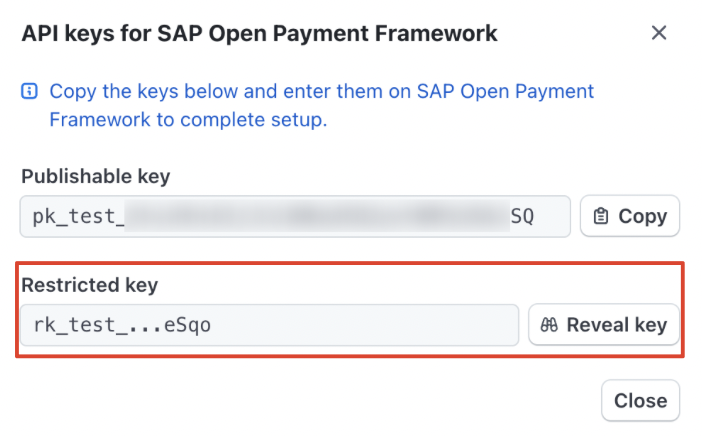
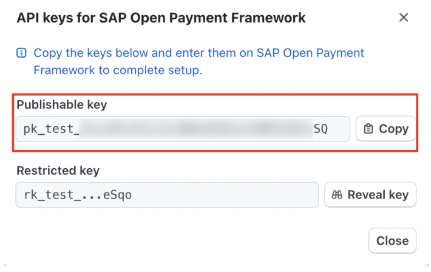
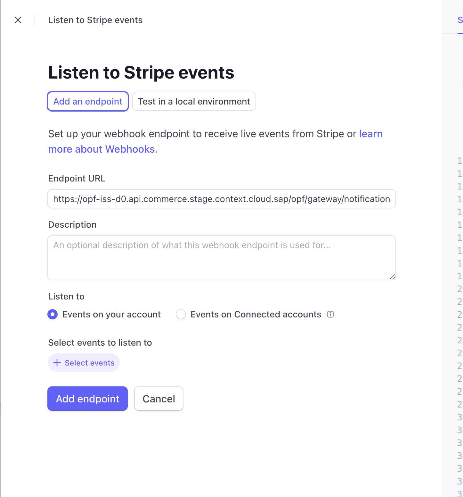
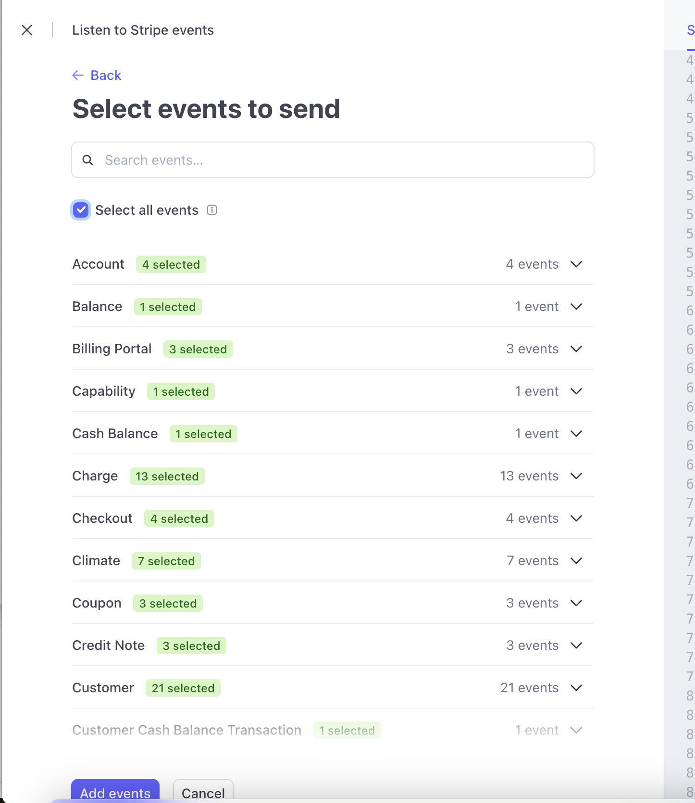
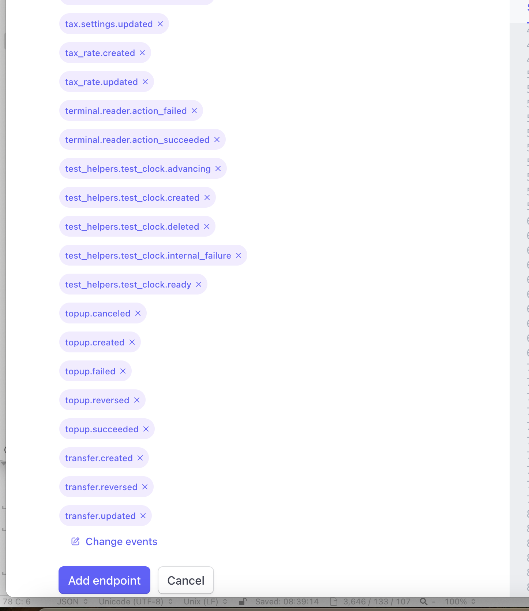
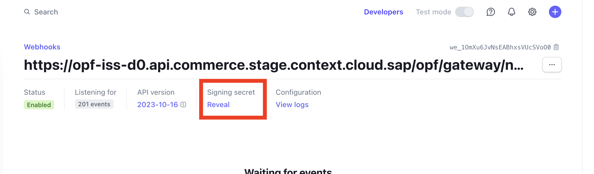

## Implementation Note ##
Generally it is recommended to use the [Stripe Payment Element](https://github.com/SAP-samples/open-payment-framework-integration/tree/main/postman/stripe/Hosted-Fields) solution over Card Element as it supports wider use cases such as 3DS and APMs.

## Introduction ##
The Postman Collection enables a [Stripe Card Element](https://docs.stripe.com/js/element/other_element?type=card) integration for payment processing through open payment framework(OPF). 

The integration supports:

* Authorization of Card Payments using PCI SAQ-A Stripe Card Element using the OPF "Hosted Fields" UX pattern
* Deferred Capture support
* Refunds
* Reversals
* Reauthorization of saved payment

In summary: to import the [Stripe Elements Postman Collection](Stripe-elements-HOSTED_FIELDS_mapping_configuration.json
) this page will guide you through the following steps: 

a) Create your Stripe test account.

b) Install SAP Open Payment Framework app in Stripe dashboard.

c) Create a Stripe payment integration in OPF workbench.

d) Set up your Stripe test account to work with OPF.

e) Prepare the [Postman Environment](Stripe-elements-HOSTED_FIELDS_environment_configuration.json) file so the collection can be imported with all your OPF Tenant and Stripe Test Account unique values. 

## Creating a Stripe Account ##
You can sign up for a free Stripe test account at https://dashboard.stripe.com/register.

## Install SAP Open Payment Framework App in Stripe Dashboard. ##
Log in to the Stripe dashboard, then search for "SAP Open Payment Framework" in the app workspace, install the SAP Open Payment Framework app, and on the app setting page, click "View API keys" button to retrieve the Publishable key and Restricted key, we will use those keys in the next step.

## Creating a Stripe Payment Integration
Create a Stripe payment integration in the OPF Workbench. For reference, see [Creating Payment Integration
](https://help.sap.com/docs/OPEN_PAYMENT_FRAMEWORK/3580ff1b17144b8780c055bbb7c2bed3/20a64f954df1425391757759011e7e6b.html).

## Preparing the Postman environment_configuration file

**1. Token**

Get your access token by [creating an external app](https://help.sap.com/docs/OPEN_PAYMENT_FRAMEWORK/8ccca5bb539a49258e924b467ee4e1c2/d927d21974fe4b368e063f72733bf0fe.html) and [making authorized API calls](https://help.sap.com/docs/OPEN_PAYMENT_FRAMEWORK/8ccca5bb539a49258e924b467ee4e1c2/40c792e66e2942209dc853a43533d78d.html).

Copy the value of the access_token field (it’s a JWT) and set as the ``token`` value in the environment file.

**IMPORTANT**: Ensure the value is prefixed with **Bearer**. e.g. ``Bearer {{token}}``.

**2. Root url**

The ``rootUrl`` is the **BASE URL** of your OPF tenant.

E.g. if your workbench/OPF cockpit url was this …

<https://opf-iss-d0.uis.commerce.stage.context.cloud.sap/opf-workbench>.

The base Url would be

https://opf-iss-d0.uis.commerce.stage.context.cloud.sap.

**3. Integration ID and Configuration ID**

The ``integrationId`` and ``configurationId`` values identify the payment integration and payment configuration, which can be found in the top left of your configuration details page in the OPF workbench.

* ``integrationId`` maps to ``accountGroupId`` in Postman
* ``configurationId`` maps to ``accountId`` in Postman

**4. Secret Key**
The secret key (or restricted key in the stripe app) can be obtained through the SAP Open Payment Framework app of Stripe dashboard we mentioned above. In test environment, it starts with **rk_test**.

Replace the ``secretKey`` variable value in the environment file with this value starting with **rk_test**.

**5. Publishable Key**

Publishable key can alse be obtained through the SAP Open Payment Framework app. In Test environment, it starts with **pk_test**.

Replace the ``publickey`` variable value in the environment file with this value starting with **pk_test**.

**6. Webhook Secret**

IN OPF Workbench: For your new Stripe payment integration, navigate to the **General Information** section of the **Integration details** tab to copy the Notification URL.

In Stripe Dashboard: Navigate to <https://dashboard.stripe.com/test/webhooks> and click **Add an Endpoint**.

i) Paste in your endpoint URL copied from OPF.

ii) For simplicity, select “All events”.

iii) Click **Add Endpoint**.

iv) Click **Reveal** the get the webhook secret, it starts with **whsec**.

v) In the environment file, set the ``webhookSecret`` value to the key starting with **whsec_**.

### Allowlist
Add the following domains to the domain allowlist in OPF workbench. For instructions, see [Adding Tenant-specific Domain to Allowlist
](https://help.sap.com/docs/OPEN_PAYMENT_FRAMEWORK/3580ff1b17144b8780c055bbb7c2bed3/a6836485b4494cfaad4033b4ee7a9c64.html).

``api.stripe.com``
``a.stripecdn.com``
``api.stripe.com``
``atlas.stripe.com``
``auth.stripe.com``
``b.stripecdn.com``
``billing.stripe.com``
``buy.stripe.com``
``c.stripecdn.com``
``checkout.stripe.com``
``climate.stripe.com``
``connect.stripe.com``
``dashboard.stripe.com``
``express.stripe.com``
``files.stripe.com``
``hooks.stripe.com``
``invoice.stripe.com``
``invoicedata.stripe.com``
``js.stripe.com``
``m.stripe.com``
``m.stripe.network``
``manage.stripe.com``
``pay.stripe.com``
``payments.stripe.com``
``q.stripe.com``
``qr.stripe.com``
``r.stripe.com``
``verify.stripe.com``
``stripe.com``
``terminal.stripe.com``
``uploads.stripe.com``

### Summary

The environment file is now ready for importing into Postman together with the Mapping Configuration Collection file. Ensure you select the correct environment before running the collection.

In summary, you should have edited the following variables: 

#### Common
- ``token``
- ``rootUrl``
- ``accountGroupId``
- ``accountId``

#### Stripe Specific
- ``publicKey``
- ``secretKey``
- ``webhookSecret``
