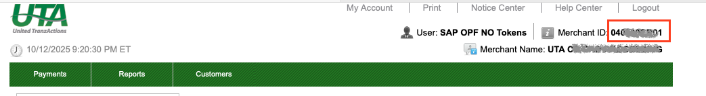
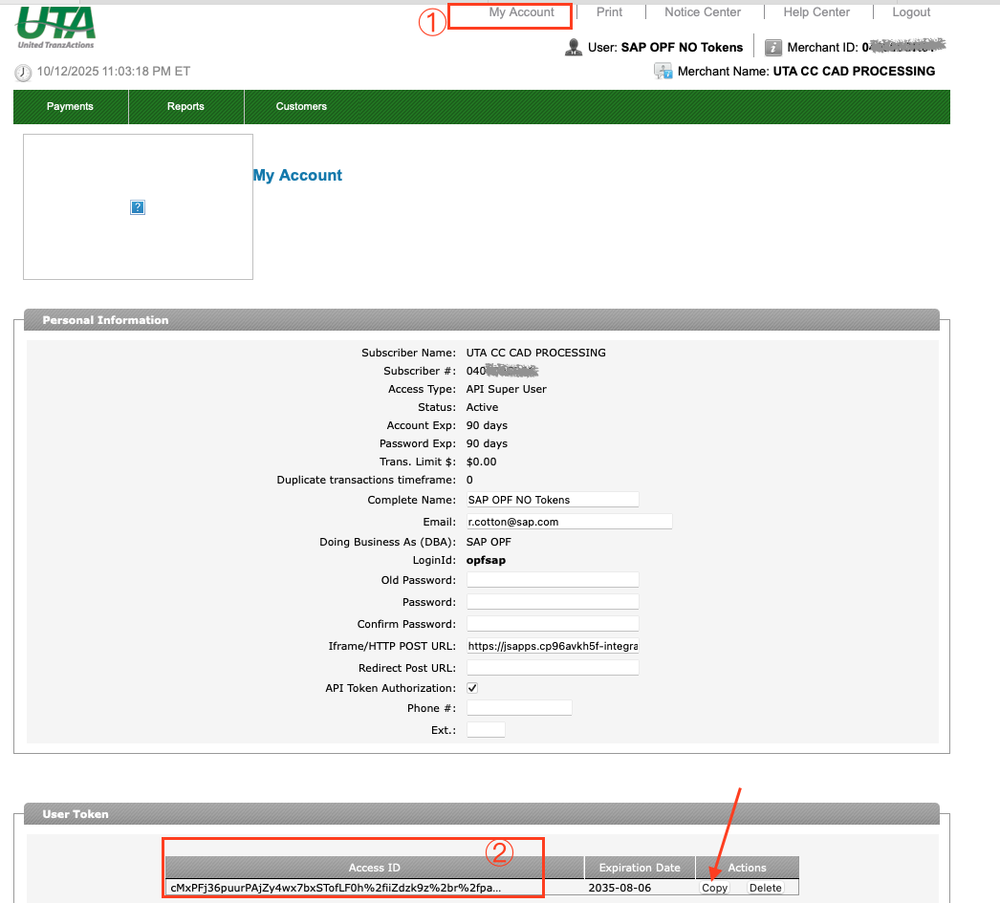

## Introduction

The Postman Collection enables a [United TranzActions](https://demo.unitedtranzactions.com)  Solution to be used to take payments through OPF. 

The integration supports:

* Authorization (SALE action for ACH)

## Setup Instructions

### Overview
To import the [United TranzActions](https://demo.unitedtranzactions.com) this page will take you through the following steps:

a) Create your United TranzActions Account

b) Create a payment integration in OPF workbench.

c) Prepare the [Postman Environment](environment_configuration.json) file so the collection can be imported with all your OPF Tenant and United TranzActions Demo Account unique values. 

d) Allowlist in OPF workbench.

### Create your United TranzActions Account

You need to contact the United TranzActions support team to obtain the login credentials.

### Create Payment Integration
Create a new integration in the OPF workbench and set the Merchant ID. For reference, see [Creating Payment Integration](https://help.sap.com/docs/OPEN_PAYMENT_FRAMEWORK/3580ff1b17144b8780c055bbb7c2bed3/20a64f954df1425391757759011e7e6b.html).

**Note**

In step 6, you need :

a) Set the Merchant ID value to the one from your United TranzActions dashboard.

### Prepare the Postman environment_configuration file

**1. Token**

Get your access token by [creating an external app](https://help.sap.com/docs/OPEN_PAYMENT_FRAMEWORK/8ccca5bb539a49258e924b467ee4e1c2/d927d21974fe4b368e063f72733bf0fe.html) and [making authorized API calls](https://help.sap.com/docs/OPEN_PAYMENT_FRAMEWORK/8ccca5bb539a49258e924b467ee4e1c2/40c792e66e2942209dc853a43533d78d.html).

Copy the value of the access_token field (it’s a JWT) and set as the ``token`` value in the environment file.

IMPORTANT: Ensure the value is prefixed with **Bearer**. e.g. ``Bearer {{token}}``.

**2. Root url**

The ``rootUrl`` is the **BASE URL** of your OPF tenant.

E.g. if your workbench/OPF cockpit url was this …

<https://opf-iss-d0.uis.commerce.stage.context.cloud.sap/opf-workbench>.

The base Url would be

https://opf-iss-d0.uis.commerce.stage.context.cloud.sap.

**3. Integration ID and Configuration ID**

The ``integrationId`` and ``configurationId`` values identify the payment integration and payment configuration, which can be found in the top left of your **Configuration Details** page in the OPF workbench.

* ``integrationId`` maps to ``accountGroupId`` in postman
* ``configurationId`` maps to ``accountId`` in postman

**4. API Credentials**

To make requests to the United TranzActions API, it is necessary to include Basic Authorization in all your calls to United TranzActions servers. The authorization header should start with ``Bearer {accessID}``. You can get the key from the [dashboard](https://demo.unitedtranzactions.com).

* Copy the ``User Token`` value to ``accessID`` in Postman.

**5. Username & Password**

To retrieve the transaction report, it is necessary to include your login credentials (username and password). Therefore, you need to map both values in the Postman collection.

### Allowlist
Add the following domains to the domain allowlist in OPF workbench. For instructions, see [Adding Tenant-specific Domain to Allowlist
](https://help.sap.com/docs/OPEN_PAYMENT_FRAMEWORK/3580ff1b17144b8780c055bbb7c2bed3/a6836485b4494cfaad4033b4ee7a9c64.html).

Sandbox: ``demo.unitedtranzactions.com``

### Summary

The environment file is now ready for importing into Postman together with the Mapping Configuration Collection file. Ensure you select the correct environment before running the collection.

In summary, you should have edited the following variables: 

#### Common
- ``token``
- ``rootUrl``
- ``accountGroupId``
- ``accountId``

#### United TranzActions Specific
- ``accessID``
- ``username``
- ``password``
  
For sandbox testing, all other values can be left as defaults.  

