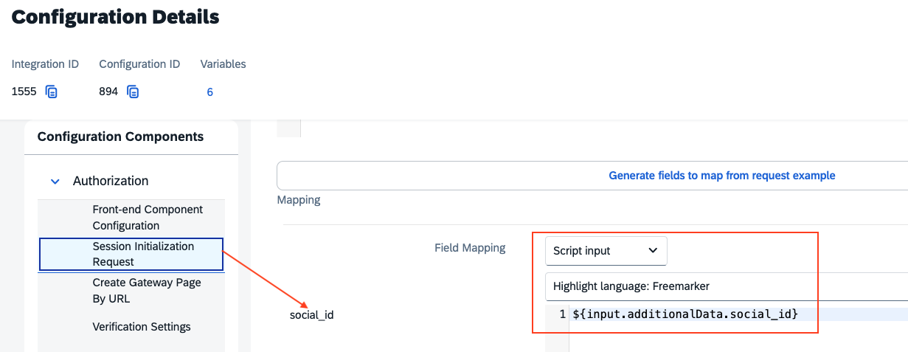

## Introduction

The Postman Collection enables a [VirtualPOS Web Checkout](https://virtualpos.readme.io/reference/introducción) Payment Form to be used to take payments through OPF. 

The integration supports:

* Authorization with auto capture

## Setup Instructions

### Overview
To import the [VirtualPOS Web Checkout](mapping_configuration.json) this page will take you through the following steps:

a) Create your VirtualPOS Account

b) Create a payment integration in OPF workbench.

c) Prepare the [Postman Environment](environment_configuration.json) file so the collection can be imported with all your OPF Tenant and VirtualPOS Demo Account unique values. 

d) Configuring Custom Cart Data for VirtualPOS Integration.

### Create your VirtualPOS Account

Request your sandbox account at soporte@virtualpos.cl. Includes the details of your project so VirtualPOS supports can configure your account with everything you need.

After getting the account,You can sign up for a free VirtualPOS Demo Account at https://comercios.virtualpos-sandbox.com/login.

### Creating Payment Integration
Create a new integration in the OPF workbench and set the Merchant ID. For reference, see [Creating Payment Integration](https://help.sap.com/docs/OPEN_PAYMENT_FRAMEWORK/3580ff1b17144b8780c055bbb7c2bed3/20a64f954df1425391757759011e7e6b.html).

**Note**

a) You can skip step 4 for the notification, as we have included the Notification URL in the Authorization configuration.

b) In step 6, you can specify a unique Merchant ID name.

### Preparing the Postman environment_configuration file

**1. Token**

Get your access token by [creating an external app](https://help.sap.com/docs/OPEN_PAYMENT_FRAMEWORK/8ccca5bb539a49258e924b467ee4e1c2/d927d21974fe4b368e063f72733bf0fe.html) and [making authorized API calls](https://help.sap.com/docs/OPEN_PAYMENT_FRAMEWORK/8ccca5bb539a49258e924b467ee4e1c2/40c792e66e2942209dc853a43533d78d.html).

Copy the value of the access_token field (it’s a JWT) and set as the ``token`` value in the environment file.

IMPORTANT: Ensure the value is prefixed with **Bearer**. e.g. ``Bearer {{token}}``.

**2. Root url**

The ``rootUrl`` is the **BASE URL** of your OPF tenant.

E.g. if your workbench/OPF cockpit url was this …

<https://opf-iss-d0.uis.commerce.stage.context.cloud.sap/opf-workbench>.

The base Url would be

https://opf-iss-d0.uis.commerce.stage.context.cloud.sap.

**3. Integration ID and Configuration ID**

The ``integrationId`` and ``configurationId`` values identify the payment integration and payment configuration, which can be found in the top left of your **Configuration Details** page in the OPF workbench.

* ``integrationId`` maps to ``accountGroupId`` in postman
* ``configurationId`` maps to ``accountId`` in postman

**4. API Credentials**

The VirtualPOS API operates through an API KEY and SECRET KEY, this set of keys are unique for each account and environment (sandbox or production),
and must be retrieved from the portal option Profile > Account Configuration > Integration:

Then ,you can find both keys:

* ``API KEY`` maps to ``apiKey`` in postman
* ``SECRET KEY`` maps to ``apiSecretKey`` in postman

**5. paymentChannel**

Name of the payment channel used by your business: Portal, App, etc.

**6. paymentDescription**

Brief description of the payment

### Configuring Custom Cart Data for VirtualPOS Integration

The ``social_id`` is a required Body parameter for creating a payment object in VirtualPOS, Follow this [SAP OPF document](https://help.sap.com/docs/OPEN_PAYMENT_FRAMEWORK/8ccca5bb539a49258e924b467ee4e1c2/f49f89c6348742f997858cca1dcf9aa1.html) 
to configure a CMS component to seamlessly pass custom payment data (e.g., social_id) to VirtualPOS during Web Checkout, leveraging Angular dependency injection and TypeScript inheritance to extend the existing open payment framework payment infrastructure without disrupting its functionality.

**Note**
The mapped valued for ``social_id`` under OPF workbench is based on what is configured in the above step.

You can update the mapped value in your OPF workbench -> Configuration Details -> Session Initialization Request -> Request Mapping:

It should match the name you have configured for the custom Cart Data, as per the  [SAP OPF document](https://help.sap.com/docs/OPEN_PAYMENT_FRAMEWORK/8ccca5bb539a49258e924b467ee4e1c2/f49f89c6348742f997858cca1dcf9aa1.html):

### Allowlist
Add the following domains to the domain allowlist in OPF workbench. For instructions, see [Adding Tenant-specific Domain to Allowlist
](https://help.sap.com/docs/OPEN_PAYMENT_FRAMEWORK/3580ff1b17144b8780c055bbb7c2bed3/a6836485b4494cfaad4033b4ee7a9c64.html).

``api.virtualpos-sandbox.com``

### Summary

The environment file is now ready for importing into Postman together with the Mapping Configuration Collection file. Ensure you select the correct environment before running the collection.

In summary, you should have edited the following variables: 

#### Common
- ``token``
- ``rootUrl``
- ``accountGroupId``
- ``accountId``

#### VirtualPOS Specific
- ``apiKey``
- ``apiSecretKey``
  
For sandbox testing, all other values can be left as defaults.  

