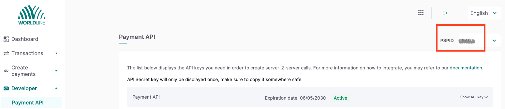
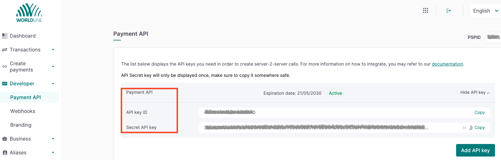
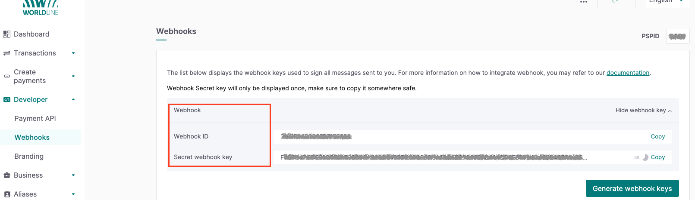

## Introduction ##
This Postman Collection aids in integrating [Worldine direct](https://docs.direct.worldline-solutions.com/en/index) into the Open Payment Framework (OPF).

The integration supports:

* Authorize card using [Payment Page](https://docs.direct.worldline-solutions.com/en/integration/basic-integration-methods/hosted-checkout-page)
* Settlement
* Refund
* Reversal
* Reauthorization

### In summary ###
In summary, to import the [Postman Collection](mapping_configuration.json), this page will guide you through the following steps:

a) [Create your Worldine direct test account](https://docs.direct.worldline-solutions.com/en/getting-started/#step-1).

b) Create a Worldine payment integration in OPF.

c) Get the credentials for your Worldine direct integration.

d) Prepare the [Postman Environment](environment_configuration.json) file so the collection can be imported with all your OPF Tenant and Wordline direct Test Account unique values. 

### Creating a Worldline direct Account ###
You can sign up for a free Worldline direct test account at [Create your Worldine Direct test account](https://docs.direct.worldline-solutions.com/en/getting-started/#step-1).

### Creating a Worldline direct Payment Integration ###
Create a Worldline direct payment integration in the OPF workbench. For reference, see [Creating Payment Integration
](https://help.sap.com/docs/OPEN_PAYMENT_FRAMEWORK/3580ff1b17144b8780c055bbb7c2bed3/20a64f954df1425391757759011e7e6b.html).

The Merchant ID is the PSP ID, it's the name you chose when you first registered with Worldline,it can found it in the worldline merchant portal.

### Setting up Your Worldline direct Test Account to work with OPF ###
Once you have created you Worldline direct test account, do the following to set it up to work with OPF:

1. Configure the payment API key/secret pair in the Merchant Portal, follow these steps:

Login to the Merchant Portal. Go to Developer > Payment API.
If you have not configured anything yet, the screen shows "No keys generated". To create both a API Key / Secret pair, click on “Add API Key”. The screen now shows both codes in the table in the “API Key ID” / “Secret API Key” line respectively
   

**Note**:
If you are using the Back Office, you can configure the API key /secret there as well. [Learn here how to do it](https://docs.direct.worldline-solutions.com/en/design-and-test-tools/applications/back-office#configureapikeyandapisecret)

2. Webhook configuration

Login to the Merchant Portal. Go to Developer > Webhooks.
If you have not configured anything yet, the screen shows "No keys generated" / "You don’t have endpoints configured at the moment."
Click on "Generate webhooks keys". The screen now shows both the "Webhooks ID" and the affiliated "Secret Webhook Key" in the table.
   

**Note**:
If you are using the Back Office, you can configure the webhook there as well. [Learn here how to do it](https://docs.direct.worldline-solutions.com/en/design-and-test-tools/applications/back-office#webhooksconfiguration)

### Preparing the Postman environment_configuration file ###

**1. Token**

Get your access token by [creating an external app](https://help.sap.com/docs/OPEN_PAYMENT_FRAMEWORK/8ccca5bb539a49258e924b467ee4e1c2/d927d21974fe4b368e063f72733bf0fe.html) and [making authorized API calls](https://help.sap.com/docs/OPEN_PAYMENT_FRAMEWORK/8ccca5bb539a49258e924b467ee4e1c2/40c792e66e2942209dc853a43533d78d.html).

Copy the value of the access_token field (it’s a JWT) and set as the ``token`` value in the environment file.

**IMPORTANT**: Ensure the value is prefixed with **Bearer**. e.g. ``Bearer {{token}}``.

**2. Root url**

The ``rootUrl`` is the **BASE URL** of your OPF tenant.

E.g. if your workbench/OPF cockpit url was this …

<https://opf-iss-d0.uis.commerce.stage.context.cloud.sap/opf-workbench>.

The base Url would be

https://opf-iss-d0.uis.commerce.stage.context.cloud.sap.

**3. Integration ID and Configuration ID**

The ``integrationId`` and ``configurationId`` values identify the payment integration and payment configuration, which can be found in the top left of your **Configuration Details** page in the OPF workbench.

* ``integrationId`` maps to ``accountGroupId`` in Postman
* ``configurationId`` maps to ``accountId`` in Postman

**4. apiKey and  apiSecret **

Fetch the stored ``apiKey and  apiSecret`` during your API key/secret pair configuration step.

**5. webhookSecret**

Fetch the stored ``secret webhook secret key`` during your Webhook configuration step.

### Allowlist
Add the following domains to the domain allowlist in OPF workbench. For instructions, see [Adding Tenant-specific Domain to Allowlist
](https://help.sap.com/docs/OPEN_PAYMENT_FRAMEWORK/3580ff1b17144b8780c055bbb7c2bed3/a6836485b4494cfaad4033b4ee7a9c64.html).

``payment.direct.worldline-solutions.com`` for production

``payment.preprod.direct.worldline-solutions.com`` for test

### Summary

The environment file is now ready for importing into Postman together with the Mapping Configuration Collection file. Ensure you select the correct environment before running the collection.

In summary, you should have edited the following variables: 

#### Common
- ``token``
- ``rootUrl``
- ``accountGroupId``
- ``accountId`` 

#### Worldline direct Specific
- ``apiKey``
- ``apiSecret``
- ``webhookSecret`` 
  
